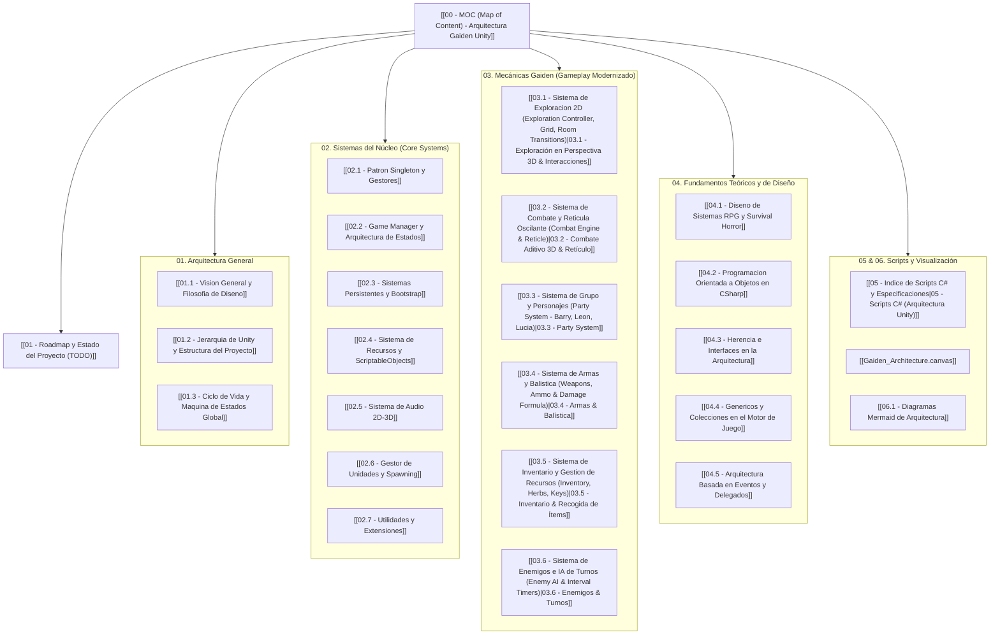

# 🧟‍♂️ Resident Evil Gaiden - Arquitectura Unity

Bienvenido a la base de conocimiento y documentación técnica para el desarrollo y diseño de un juego en **Unity** con mecánicas inspiradas en **Resident Evil Gaiden (Game Boy Color)**.

Este proyecto de Obsidian estructura y adapta:
1. **La ingeniería inversa / decompilación de RE Gaiden** (lógica extraída en C, fórmulas de daño, timing de combate, gestión de grupo e inventario).
2. **La arquitectura de desarrollo en Unity** (`Assets/_Scripts/`: Singleton Managers, Game Manager, Persistent Systems, Resource System, Audio System, Scriptable Objects, Unit Manager, Unity Hierarchy y Utilities).
3. **Los fundamentos teóricos y de diseño de software** (Diseño de sistemas RPG y Survival Horror, Programación Orientada a Objetos en C#, Herencia e Interfaces, Tipos Genéricos y Colecciones, y Arquitectura Dirigida por Eventos).

---

## 🗺️ Mapa de Contenidos (MOC)

---

## 📂 Directorios de la Bóveda

| Directorio | Propósito | Notas Clave |
| :--- | :--- | :--- |
| **`00 - Indice`** | MOC interactivo y hoja de ruta de desarrollo. | [[00 - MOC (Map of Content) - Arquitectura Gaiden Unity\|MOC]], [[01 - Roadmap y Estado del Proyecto (TODO)\|Roadmap & TODO]] |
| **`01 - Arquitectura General`** | Estructura macro del proyecto en Unity, jerarquía multi-escena y ciclo de ejecución. | [[01.1 - Vision General y Filosofia de Diseno\|Visión General]], [[01.2 - Jerarquia de Unity y Estructura del Proyecto\|Jerarquía]], [[01.3 - Ciclo de Vida y Maquina de Estados Global\|Ciclo de Vida]] |
| **`02 - Core Systems`** | Sistemas base desacoplados y persistentes basados en la plantilla de Unity. | [[02.1 - Patron Singleton y Gestores\|Singletons]], [[02.2 - Game Manager y Arquitectura de Estados\|GameManager]], [[02.3 - Sistemas Persistentes y Bootstrap\|Systems]], [[02.4 - Sistema de Recursos y ScriptableObjects\|Recursos]], [[02.5 - Sistema de Audio 2D-3D\|Audio]], [[02.6 - Gestor de Unidades y Spawning\|Unidades]] |
| **`03 - Mecanicas Gaiden`** | Especificación técnica de las mecánicas modernizadas de *Resident Evil Gaiden*. | [[03.1 - Sistema de Exploracion 2D (Exploration Controller, Grid, Room Transitions)\|Exploración Perspectiva]], [[03.2 - Sistema de Combate y Reticula Oscilante (Combat Engine & Reticle)\|Combate Aditivo 3D]], [[03.3 - Sistema de Grupo y Personajes (Party System - Barry, Leon, Lucia)\|Party]], [[03.4 - Sistema de Armas y Balistica (Weapons, Ammo & Damage Formula)\|Armas]], [[03.5 - Sistema de Inventario y Gestion de Recursos (Inventory, Herbs, Keys)\|Inventario]] |
| **`04 - Fundamentos Teoricos y Diseno`** | Base teórica y principios de ingeniería de software necesarios para la arquitectura. | [[04.1 - Diseno de Sistemas RPG y Survival Horror\|Sistemas RPG]], [[04.2 - Programacion Orientada a Objetos en CSharp\|POO en C#]], [[04.3 - Herencia e Interfaces en la Arquitectura\|Herencia e Interfaces]], [[04.4 - Genericos y Colecciones en el Motor de Juego\|Genéricos y Colecciones]], [[04.5 - Arquitectura Basada en Eventos y Delegados\|Eventos y Delegados]] |
| **`05 - Scripts C# (Arquitectura Unity)`** | Código fuente en C# sincronizado con `Assets/Scripts/`. | Implementación completa de Managers, Controladores, Entidades e Interfaces |
| **`06 - Diagramas y Canvas`** | Canvas interactivo de Obsidian (`.canvas`) y diagramas de secuencia/clases en Mermaid. | [[Gaiden_Architecture.canvas]], [[06.1 - Diagramas Mermaid de Arquitectura]] |

---

## 🎯 Rutas de Lectura Recomendadas

### 🔹 Para Programadores de Sistemas Core
1. Empezar por [[02.1 - Patron Singleton y Gestores]] para comprender la jerarquía de herencia genérica (`StaticInstance` $\to$ `Singleton` $\to$ `PersistentSingleton`).
2. Estudiar [[02.3 - Sistemas Persistentes y Bootstrap]] y [[02.2 - Game Manager y Arquitectura de Estados]].
3. Continuar con [[02.4 - Sistema de Recursos y ScriptableObjects]] y [[04.4 - Genericos y Colecciones en el Motor de Juego]].
4. Revisar la implementación de eventos en [[04.5 - Arquitectura Basada en Eventos y Delegados]].

### 🔹 Para Programadores de Gameplay (Mecánicas Gaiden)
1. Analizar [[03.2 - Sistema de Combate y Reticula Oscilante]] para dominar la fórmula matemática del retículo oscilante y los hitzones críticos.
2. Explorar [[03.1 - Sistema de Exploracion 2D]] para la navegación top-down en cuadrícula y detección de encuentros con zombies.
3. Consultar [[03.3 - Sistema de Grupo y Personajes]], [[03.4 - Sistema de Armas y Balistica]] y [[03.5 - Sistema de Inventario y Gestion de Recursos]].
4. Integrar con [[02.6 - Gestor de Unidades y Spawning]].

### 🔹 Para Diseñadores y Arquitectos de Software
1. Leer [[01.1 - Vision General y Filosofia de Diseno]] y [[01.2 - Jerarquia de Unity y Estructura del Proyecto]].
2. Comprender los fundamentos de balance en [[04.1 - Diseno de Sistemas RPG y Survival Horror]].
3. Abrir el lienzo visual interactivo [[Gaiden_Architecture.canvas]] en Obsidian.
4. Revisar los diagramas de clases y secuencias en [[06.1 - Diagramas Mermaid de Arquitectura]].
