# 📋 Roadmap y Estado de Desarrollo (TODO & Changelog)

Este documento centraliza el estado actual del desarrollo del proyecto **Resident Evil Gaiden (Adaptación Unity)**, registrando los hitos técnicos alcanzados en el Proof of Concept (PoC) y la hoja de ruta priorizada para las siguientes fases de producción.

---

## 📌 Resumen de Estado Actual (Proof of Concept - PoC)

> [!NOTE] Estado General
> **PoC Funcional Verificado al 100% en Runtime**. Se han desplegado y testeado en el editor de Unity (versión 6000.3.26f1) los bucles principales de exploración cenital en perspectiva, interfaz de inventario de 8 casillas e instancia de combate 3D aditiva independiente.

```mermaid
flowchart LR
    subgraph Fase0["Fase 0: Arquitectura Base"]
        direction TB
        F0_1["Arquitectura Singleton & Systems"]
        F0_2["GameManager & Máquina de Estados"]
        F0_3["ScriptableObjects & ResourceSystem"]
    end

    subgraph Fase1["Fase 1: Proof of Concept & Testing Funcional (ACTUAL)"]
        direction TB
        F1_1["Cámara Top-Down Perspectiva 3D"]
        F1_2["Movimiento 3D & New Input System"]
        F1_3["Recogida y Soltado de Ítems (Pick/Drop)"]
        F1_4["Inventario 8 Casillas sin Rebote"]
        F1_5["Instancia Combate Aditiva (03_CombatArena)"]
        F1_6["Retículo Oscilante & Fórmulas Críticas"]
        F1_7["Escena Testing: Puertas, Escaleras & Cajas"]
    end

    subgraph Fase2["Fase 2: Expansión de Gameplay"]
        direction TB
        F2_1["Modelos 3D Finales & Animaciones"]
        F2_2["IA Avanzada de Patrulla y Sigilo"]
        F2_3["Audio Espacial 3D y Banda Sonora"]
        F2_4["Sistema de Guardado (Save/Load)"]
        F2_5["Nivel Completo: Barco S.S. Starlight"]
    end

    Fase0 --> Fase1
    Fase1 -.-> Fase2

    style Fase0 fill:#1b382b,stroke:#449e6f,color:#fff
    style Fase1 fill:#1a3a52,stroke:#3b82f6,color:#fff
    style Fase2 fill:#3d271d,stroke:#f59e0b,color:#fff
```

---

## ✅ Hitos Alcanzados y Verificados (Changelog de Implementación)

### 1. Sistema de Exploración 3D en Perspectiva
- [x] **Cámara en Perspectiva Top-Down**: Implementado `CameraController.cs` con inclinación de $\approx 55^\circ$, FOV en perspectiva (45°), seguimiento suave (`Vector3.SmoothDamp`) y *deadzone* configurable sin nombres propietarios.
- [x] **Controlador de Exploración Moderno**: `ExplorationController.cs` adaptado a `CharacterController` 3D sobre geometría del nivel, con orientación cardinal hacia la dirección de avance, colisiones tridimensionales y ajustes de escalón (`stepOffset = 0.45f`).
- [x] **Migración Total al Nuevo Input System**: Sustitución completa de `UnityEngine.Input` legacy por `UnityEngine.InputSystem`, con compatibilidad simultánea para teclado/ratón y gamepads (Xbox, PlayStation, etc.).
- [x] **Patrón de Cáscaras (*Shells*)**: Entidades de personajes (`Player_HeroShell`, `HeroUnit`) y enemigos (`Enemy_Overworld_Shell`, `EnemyOverworldUnit`) desacopladas de mallas finales, permitiendo reemplazo instantáneo de modelos 3D sin modificar lógica.

### 2. Recogida y Soltado de Objetos en el Escenario (`ItemPickup` & `DropItem`)
- [x] **Colisionador Trigger**: Configuración estricta de `BoxCollider.isTrigger = true` para evitar que las cajas de munición o hierbas bloqueen el paso del jugador como obstáculos sólidos.
- [x] **Feedback Visual Diegético**: Animación matemática de flotación senoidal y rotación continua sobre el eje Y (estilo retro survival horror).
- [x] **Doble Método de Recolección**:
  - Automático por paso encima (`OnTriggerEnter` con tag `"Player"`).
  - Manual por proximidad e interacción (`IInteractable` con tecla `E` o botón sur del mando).
- [x] **Soltado Dinámico al Mundo (`InventorySystem.DropItem`)**: Funcionalidad para botar cualquier objeto del maletín al suelo 3D frente al jugador. Se instancia un objeto con `ItemPickup` conservando su `ItemId` para que pueda re-recogerse.
- [x] **Integración con Inventario**: Incremento y decremento inmediato de las casillas correspondientes en `InventorySystem` y notificación mediante eventos.

### 3. Sistema de Inventario y Maletín de 8 Casillas
- [x] **Menú Clásico de 8 Casillas**: Interfaz completa en `InventoryUI.cs` con rejilla de 2 columnas $\times$ 4 filas, detalle del objeto seleccionado, estado de salud de la party e indicador de veneno.
- [x] **Mecanismo Anti-Rebote (Debounce Cooldown)**: Control temporal (`Time.unscaledTime - _openedTime < 0.25f`) que impide que el fotograma de apertura vuelva a cerrar el inventario al instante por persistencia de tecla.
- [x] **Uso Inmediato de Consumibles**: Atajos de teclado numéricos `1` a `8` y clics interactivos para consumir hierbas verdes, botiquines y sprays curando al héroe activo.
- [x] **Atajos de Soltar Ítems**: Teclas `[D]` o `[X]` en el inventario para botar el objeto de la casilla seleccionada directamente al escenario.
- [x] **Retorno Estable**: Cierre fluido mediante tecla `I`, `Tab`, `Escape` o botón Este del mando, restaurando el estado a `Exploration`.

### 4. Instancia de Combate Separada (Escena Aditiva Estilo *Persona* / JRPG)
- [x] **Escena Dedicada 3D (`Assets/Scenes/03_CombatArena.unity`)**:
  - Geometría física propia de arena: suelo, muros oscuros y punto de anclaje `EnemySpawnPoint`.
  - Cámara de combate independiente (`CombatCamera`) con ángulo frontal en primera/tercera persona.
  - Set de iluminación dramática: foco cenital de tensión (`CombatSpotLight`) y luz de relleno fría.
  - Canvas de combate translúcido (`Combat_Canvas`) que deja visible la arena física y al enemigo 3D.
  - Componente `CombatArenaDirector.cs` que proyecta la información visual del `ScriptableEnemy` en runtime.
- [x] **Carga y Descarga Asíncrona Aditiva (`CombatManager.cs`)**:
  - Al colisionar en el overworld, se apaga la cámara y audio de exploración y se carga aditivamente `03_CombatArena` (`LoadSceneMode.Additive`).
  - Al vencer al enemigo, tras 1.2 segundos de feedback de victoria, se elimina la unidad enemiga del pasillo (`UnitManager.RemoveEnemy`), se descarga asíncronamente `03_CombatArena` (`SceneManager.UnloadSceneAsync`), se reactiva la cámara de exploración y se vuelve a `Exploration`.
- [x] **Motor de Retículo Oscilante**: Aguja oscilante precisa a 60 FPS con cálculo estricto de distancias al centro de la diana, zonas de impacto normal y diana crítica, aplicando multiplicadores de daño por arma y control de munición.

### 5. Escena de Pruebas Funcionales y Mecánicas de Interacción (`01_Functional_Testing`)
- [x] **Escena Dedicada de Pruebas (`Assets/Scenes/01_Functional_Testing.unity`)**:
  - Entorno de testing completo con suelo $26\times26$m, muros perimetrales, muro divisorio central y dos accesos.
  - Entorno multi-nivel con plataforma Mezzanine elevada a $Y=3.0$m, barandillas perimetrales y huecos de acceso.
- [x] **Interacción con Puertas (`DoorInteractable.cs`)**:
  - Sistema de puertas que implementa `IInteractable` para apertura/cierre interactivo (tecla `E` o botón de acción).
  - Animación suave mediante interpolación angular (puertas batientes) o lineal (puertas correderas).
  - Puerta estándar desbloqueada (`Door_Standard_Unlocked`).
  - Puerta de seguridad bloqueada (`Door_Security_Locked`) que verifica en `InventorySystem.HasItem` la posesión de `ItemId.KeyCard_Level1`.
- [x] **Verticalidad y Escaleras (`CharacterController` + `LadderZone.cs`)**:
  - Navegación fluida por escaleras de 10 peldaños ($Y=0$ a $Y=3$) gracias al `stepOffset = 0.45f` y `slopeLimit = 45f` en `ExplorationController`.
  - Rampa inclinada continua con respuesta estable de física y gravedad.
  - Escalera de mano vertical con `LadderZone.cs`: al entrar en el trigger, el jugador entra en modo de escalada vertical (`SetClimbingMode(true)`), suspendiendo la gravedad y permitiendo subir/bajar por el eje Y con `W/S` o el stick vertical.
- [x] **Empuje Físico de Cajas (`PushableBox.cs`)**:
  - Cajas físicas con componente `Rigidbody`, masa calibrada y fricción lineal (`drag = 5f`).
  - Bloqueo de rotaciones (`FreezeRotation`) y bloqueo de eje Y (`FreezePositionY`) para evitar volteos o despegues indeseados.
  - Empuje direccional integrado en `ExplorationController.OnControllerColliderHit`: filtra colisiones de suelo (`hit.normal.y > 0.6f`), calcula la dirección horizontal del empuje y aplica fuerza continua en `FixedUpdate`.
- [x] **Registro de Escenas en Build Settings**:
  - `00_Bootstrap.unity` (0)
  - `01_Functional_Testing.unity` (1)
  - `02_Ship_DeckA.unity` (2)
  - `03_CombatArena.unity` (3)

---

## 🎯 Backlog Priorizado (TODO)

### 🔹 Fase 2: Arte, Assets y Experiencia Audiovisual
- [ ] **Modelos 3D y Rigs de Héroes**:
  - Reemplazar la cápsula de `Player_HeroShell` con modelo 3D de Barry Burton.
  - Configurar Animator Controller con animaciones de *Idle*, *Walk*, *Run* y *Hurt*.
- [ ] **Modelos 3D de Enemigos**:
  - Modelos y shaders para Zombie Estándar, Zombie Femenino, Zombie Armado y Cerberus.
  - Animaciones de aproximación en la arena de combate y reacción al recibir daño (flinch).
- [ ] **Diseño Sonoro Integral (AudioSystem)**:
  - Integrar pistas musicales ambientales para el *S.S. Starlight* y tema de combate por turnos.
  - Implementar efectos de sonido (SFX): pasos en metal/madera, disparos de Handgun/Shotgun, chasquido de aguja oscilante en zona crítica y gemidos de zombies.
- [ ] **Post-Processing y Atmósfera Visual**:
  - Configurar perfil de volumen de post-procesado con grano cinematográfico retro, viñeta, aberración cromática ligera y niebla volumétrica.

### 🔹 Fase 3: Mecánicas Avanzadas de Gameplay
- [ ] **Comportamiento e IA en Overworld**:
  - Estados de IA de patrulla para zombies en los pasillos: *Patrol*, *Alert* (al escuchar pasos/sprint del jugador) y *Chase*.
  - Cono de visión y rango de audición configurable mediante ScriptableObjects.
- [ ] **Mecánica de Huida en Combate**:
  - Implementar opción de escapar del combate activo con probabilidad basada en la agilidad del héroe o costo de turnos.
- [x] **Sistema de Puertas con Llave y Apertura Interactiva**:
  - Implementado `DoorInteractable.cs` con rotación suave y validación de llaves/tarjetas en `InventorySystem` (probado con `KeyCard_Level1`).
  - Pendiente para Fase 3: Animación clásica de cambio de plano o fade a negro para transiciones entre escenas de cubiertas.
- [ ] **Combinación de Objetos en Inventario**:
  - Drag-and-drop o selección dual en `InventoryUI` para combinar Hierba Verde + Hierba Verde, o Hierba Verde + Hierba Roja.

### 🔹 Fase 4: Sistemas de Guardado y UI Global
- [ ] **Sistema de Guardado y Carga (SaveSystem)**:
  - Puntos de guardado en habitaciones seguras (máquinas de escribir / cintas de tinta).
  - Serialización a JSON o binario del estado de la party, inventario y zombies eliminados por sala.
- [ ] **Menú Principal y Pantalla de Game Over**:
  - Escena `01_TitleScreen` con selector de idioma, opciones de audio y carga de partida.
  - Pantalla interactiva de `GameOver_Canvas` con opciones de reintentar desde el último checkpoint o volver al título.

### 🔹 Fase 5: Expansión de Niveles (El Trasatlántico S.S. Starlight)
- [ ] **Diseño de Cubiertas Adicionales**:
  - `02_Ship_DeckB` (Camarotes de pasajeros y comedor).
  - `02_Ship_EngineRoom` (Sala de calderas y generadores).
  - `02_Ship_Bridge` (Puente de mando y comunicaciones).
  - `02_Ship_Labs` (Laboratorio secreto de Umbrella en las profundidades).

---

## 🛠️ Decisiones Técnicas de Arquitectura (ADR Summary)

| ID | Decisión | Alternativa Descartada | Razón y Beneficio |
| :--- | :--- | :--- | :--- |
| **ADR-01** | **Cámara Top-Down en Perspectiva 3D** (~55°) | Cámara 2D Ortográfica pura | Proporciona una estética inmersiva con profundidad espacial, sombras dinámicas y volumetría 3D. |
| **ADR-02** | **Combate como Escena Aditiva Separada** (`03_CombatArena`) | Canvas de UI superpuesto en la escena de exploración | Aislamiento completo de física, cámaras, luces y recursos (estilo *Persona*). Evita saturar la escena de exploración y permite arenas 3D inmersivas. |
| **ADR-03** | **Uso Exclusivo de Unity Input System Package** | `UnityEngine.Input` legacy | Soporte multiplataforma robusto para mandos modernos, rebinding y eliminación de advertencias del motor. |
| **ADR-04** | **Arquitectura de Cáscaras (*Shells*)** | Prefabs con mallas finales acopladas | Permite iterar la jugabilidad, balance y lógica de combate sin esperar a que el pipeline de modelado 3D esté finalizado. |
| **ADR-05** | **Singleton Auto-Instanciable para Recursos** | Búsqueda manual de assets en runtime | `ResourceSystem` garantiza acceso inmediato a datos de armas, héroes y enemigos incluso al lanzar escenas aisladas en el Editor. |
| **ADR-06** | **Escena Aislada de Testing Funcional** (`01_Functional_Testing`) | Probar mecánicas directamente en escenas de producción | Permite verificar física, escaleras, verticalidad, empuje de cajas y puertas en un entorno controlado con 0 riesgo de romper niveles narrativos. |
