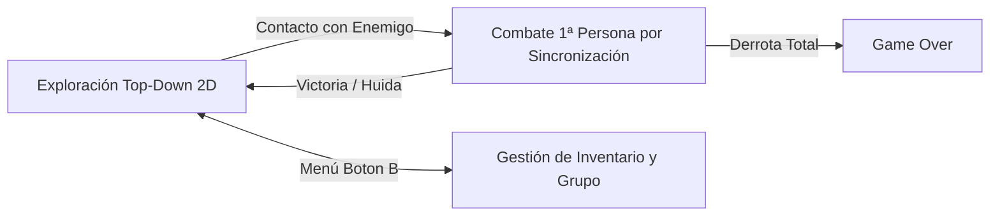

# 01.1 - Visión General y Filosofía de Diseño

## 🎯 Objetivo del Proyecto
El propósito de esta arquitectura es proporcionar un marco robusto, modular y testeable en **Unity** para desarrollar un videojuego con las mecánicas clave de **Resident Evil Gaiden** (originalmente lanzado para Game Boy Color en 2001 por Capcom / Virgin Interactive / M4).

A diferencia de los Resident Evil tradicionales (cámara fija pre-renderizada en 3D con controles tipo tanque), *Gaiden* presenta una estructura híbrida fascinante:
1. **Fase de Exploración en Vista Cenital (Top-Down 2D)**: Control de Barry Burton en el trasatlántico de lujo *S.S. Starlight*, movimiento en cuadrícula con opción de sprint, búsqueda de munición y llaves, y evasión/contacto con zombies en el mapa.
2. **Fase de Combate en Primera Persona con Barra de Sincronización (Timing Gauge)**: Al entrar en contacto con un enemigo, el juego cambia radicalmente a un combate por turnos en primera persona donde el jugador dispara interactuando con una aguja oscilante sobre un retículo con zonas de impacto y diana crítica.
3. **Gestión de Recursos y Grupo (Party Survival)**: Grupo integrado por Barry Burton, Leon S. Kennedy y Lucia, con estados alterados (veneno), munición limitada, botiquines y combinación de hierbas.

---

## 🏛️ Principios y Filosofía Arquitectural

Para trasladar el código desensamblado en ensamblador SM83 / C a Unity moderno sin caer en la sobreingeniería ni en el código espagueti descontrolado, nos basamos en los siguientes pilares:

### 1. Desacoplamiento Basado en Eventos (Event-Driven Architecture)
Siguiendo los principios de la [[04.5 - Arquitectura Basada en Eventos y Delegados|Arquitectura Basada en Eventos y Delegados]]:
- Los sistemas centrales (como `CombatManager` o `InventorySystem`) no deben referenciar directamente elementos de UI, reproductores de audio o efectos visuales.
- En su lugar, publican eventos C# (`event Action<T>`).
- La interfaz de usuario (`HUDController`), el [[02.5 - Sistema de Audio 2D-3D|AudioSystem]] y los efectos visuales se suscriben y reaccionan de manera autónoma.

### 2. Configuración Basada en Datos (Data-Driven Design con ScriptableObjects)
De acuerdo con la [[04.2 - Programacion Orientada a Objetos en CSharp|Programación Orientada a Objetos y ScriptableObjects]]:
- **Cero valores mágicos quemados en código (Hardcoding)**:
  - En la ROM original, los datos de monstruos y armas se ubicaban en tablas estáticas del Banco de ROM `0D` (`0x409C` y `0x40A2`).
  - En Unity, estos datos se convierten en `ScriptableObjects` (`ScriptableUnit`, `ScriptableWeapon`, `ScriptableItem`).
- Esto permite a los diseñadores balancear valores de daño, anchos de retícula (`hit_width`, `crit_width`), cadencias y sprays sin recompilar código.

### 3. Jerarquía de Instancias Estáticas y Persistencia Controlada
Basándonos en la estructura de `StaticInstance.cs` (`_Scripts/Utilities/`):
- Se divide el ciclo de vida en tres niveles:
  1. `StaticInstance<T>`: Para gestores específicos de escena (ej. `UnitManager`, `ReticleController`). Si se recarga la escena, se resetean automáticamente.
  2. `Singleton<T>`: Garantiza una única instancia destruyendo duplicados que puedan crearse por accidente.
  3. `PersistentSingleton<T>`: Para sistemas globales (`Systems`, `AudioSystem`, `ResourceSystem`) que deben sobrevivir a la carga de escenas mediante `DontDestroyOnLoad`.

> [!tip] Regla de Oro del Acoplamiento
> Los subsistemas dentro del contenedor persistente `Systems` pueden acoplarse de manera controlada para agilizar el desarrollo de juegos medianos, pero las entidades de gameplay del mundo (zombies, cofres, puertas) deben comunicarse con la infraestructura mediante interfaces (`IDamageable`, `IInteractable`) y delegados.

---

## 🔄 Correspondencia: Decompilación C vs Arquitectura Unity C#

| Componente en C (Decompilación `re_gaiden.h`) | Equivalente en Unity C# | Notas Arquitecturales |
| :--- | :--- | :--- |
| `GaidenGame` (Estructura de contexto global) | [[02.2 - Game Manager y Arquitectura de Estados\|GaidenGameManager]] + [[02.3 - Sistemas Persistentes y Bootstrap\|Systems]] | Orquesta la máquina de estados y las transiciones globales. |
| `CombatState` + `combat.c` | [[03.2 - Sistema de Combate y Reticula Oscilante\|CombatManager]] + `ReticleController` | Gestiona la aguja de 0..120 px, el cálculo de daño y los turnos. |
| `ExplorationState` + `exploration.c` | [[03.1 - Sistema de Exploracion 2D\|ExplorationController]] | Movimiento top-down en cuadrícula, colisiones de tiles y triggers. |
| `Character` + `player.c` | [[03.3 - Sistema de Grupo y Personajes\|PartyManager]] + `HeroUnitBase` | Salud de Barry, Leon y Lucia, selección de personaje activo y veneno. |
| `s_weapon_defs` (Banco ROM 0D) | `ScriptableWeapon` | Definición de munición, daño base y multiplicador crítico. |
| `s_enemy_defs` (Banco ROM 0D) | `ScriptableEnemy` + [[03.6 - Sistema de Enemigos e IA de Turnos\|EnemyUnitBase]] | Parámetros del zombie: vida, velocidad de aguja, diana crítica e intervalo de turno. |
| `Inventory` (Slots y municiones) | [[03.5 - Sistema de Inventario y Gestion de Recursos\|InventorySystem]] | Listas y diccionarios de consumibles y llaves maestras. |
| `g_framebuffer` / Video GBC | Unity Rendering Pipeline / SpriteRenderer / Canvas UI | Modernización con gráficos retro 2D/Pixel Art mediante cámaras ortográficas. |

---

## 📑 Siguiente Paso Recomendado
Continuar con la especificación de la jerarquía de Unity y la disposición de carpetas en [[01.2 - Jerarquia de Unity y Estructura del Proyecto]].
