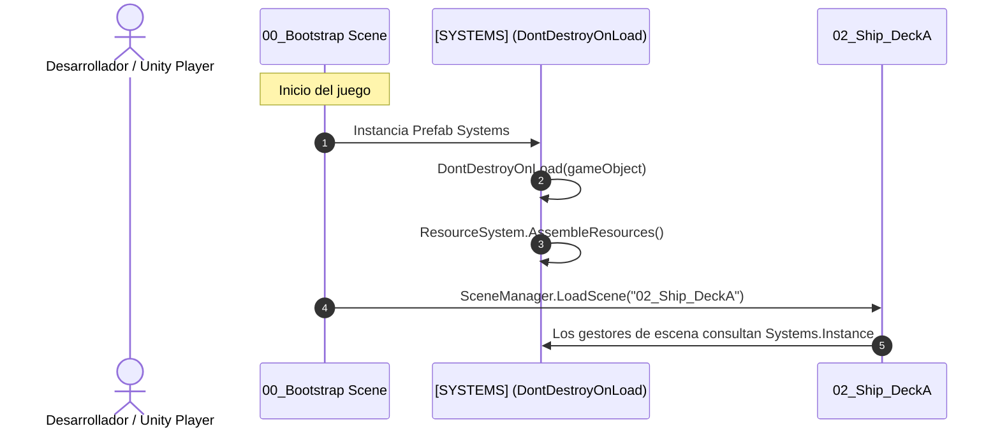

# 01.2 - Jerarquía de Unity y Estructura del Proyecto

Una estructura de carpetas limpia y una jerarquía de escena predecible son indispensables para evitar dependencias circulares, objetos huérfanos y desorden en el Inspector de Unity.

---

## 📁 Estructura del Proyecto (`Assets/`)

El árbol de carpetas en el proyecto de Unity sigue la convención estándar de la industria, optimizada para arquitectura basada en `ScriptableObjects` y sistemas desacoplados:

```
Assets/
├── _Scripts/
│   ├── Combat/               # Lógica del combate por sincronización (Reticle, Gauge, Turns)
│   ├── Exploration/          # Control top-down, Grid, Triggers de puertas y colisiones
│   ├── Interfaces/           # Contratos desacoplados (IDamageable, IInteractable, etc.)
│   ├── Managers/             # Gestores de escena (GaidenGameManager, UnitManager, SceneDirector)
│   ├── Scriptables/          # Definiciones de ScriptableObjects (Units, Weapons, Items)
│   ├── Systems/              # Subsistemas del núcleo (Systems container, AudioSystem, ResourceSystem)
│   ├── Units/                # Clases de unidades (UnitBase, Heroes: Barry, Leon; Enemies: Zombies)
│   └── Utilities/            # Helpers, Singletons genéricos, Extensiones, Constantes
├── Audio/
│   ├── Music/                # Pistas de exploración (Starlight), combate y suspense
│   └── SFX/                  # Disparos (Handgun, Shotgun), impactos, pasos, gemidos zombie
├── Prefabs/
│   ├── Core/                 # Prefab del objeto raíz [SYSTEMS] con DontDestroyOnLoad
│   ├── Enemies/              # Prefabs de zombies para exploración y visual de combate
│   ├── Heroes/               # Prefab de Barry, Leon, Lucia
│   └── UI/                   # Menú de inventario, HUD de vida, barra de retículo oscilante
├── Resources/
│   ├── Items/                # ScriptableItems cargados dinámicamente por ResourceSystem
│   ├── Units/                # ScriptableUnits (Barry, Leon, Lucia, ZombieMale, etc.)
│   └── Weapons/              # ScriptableWeapons (Cuchillo, Handgun, Shotgun, etc.)
├── Scenes/
│   ├── 00_Bootstrap          # Escena inicial liviana que carga los sistemas persistentes
│   ├── 01_TitleScreen        # Menú principal y selección de idioma
│   ├── 02_Ship_DeckA         # Primera zona de exploración (Corredor S.S. Starlight)
│   └── 03_CombatArena        # Escena o subescena aditiva para la vista de combate
└── Sprites/
    ├── Characters/           # Spritesheets de Barry, Leon, zombies en vista top-down
    ├── Combat/               # Retícula, aguja blanca, fondos en 1ª persona, sprites de monstruos
    ├── Environment/          # Tilesets del barco (paredes, suelos metálicos, puertas)
    └── UI/                   # Iconos de armas, hierbas, sprays, marcos de estado
```

---

## 🌳 Jerarquía de Escena en Unity (`Hierarchy`)

Para evitar objetos sueltos en la raíz de la escena, se utiliza una convención de **nodos contenedores organizadores** con transformaciones reseteadas (`Position: 0, 0, 0`, `Scale: 1, 1, 1`):

```
Scene Hierarchy:
├── [=== PERSISTENT SYSTEMS ===] (Instanciado vía Bootstrap / DontDestroyOnLoad)
│   └── Systems (Script: Systems.cs - PersistentSingleton)
│       ├── ResourceSystem (Script: ResourceSystem.cs)
│       ├── AudioSystem (Script: AudioSystem.cs - AudioSource Music / Sounds)
│       └── SaveSystem (Script: SaveSystem.cs)
│
├── [=== SCENE MANAGERS ===]
│   ├── GaidenGameManager (Script: GaidenGameManager.cs - Singleton de escena)
│   ├── UnitManager (Script: UnitManager.cs - Spawner de héroes y enemigos)
│   └── CombatManager (Script: CombatManager.cs - Activo o alternado por estado)
│
├── [=== CAMERAS & LIGHTING ===]
│   ├── Main Camera (Ortográfica para Top-Down 2D)
│   ├── Combat Camera (Cámara dedicada para vista en 1ª persona o render texture)
│   └── Global Light 2D / Ambient Light
│
├── [=== ENVIRONMENT & GRID ===]
│   ├── Grid (Componente Grid de Unity)
│   │   ├── Ground Tilemap (Suelos del Starlight)
│   │   ├── Walls Tilemap (Colisionadores Tilemap Collider 2D)
│   │   └── Doors & Interactors (Triggers de cambio de habitación y llaves)
│   └── ItemPickups (GameObjects interactivos de munición y hierbas en el suelo)
│
├── [=== UNITS ===]
│   ├── PartyContainer
│   │   └── PlayerController (Barry / Personaje activo en exploración)
│   └── EnemyContainer
│       ├── Zombie_Overworld_01 (Trigger de combate al contacto)
│       └── Zombie_Overworld_02
│
└── [=== UI_CANVAS ===]
    ├── HUD_Canvas (Barra de salud de Barry, munición del arma equipada)
    ├── Combat_Canvas (Barra del retículo de combate, aguja oscilante, diana)
    └── Inventory_Canvas (Rejilla de 8 casillas, selector de arma y grupo)
```

---

## 🚀 Flujo Multi-Escena: El Patrón Bootstrap

Para garantizar que los sistemas persistentes ([[02.3 - Sistemas Persistentes y Bootstrap|Systems]]) existan siempre sin importar qué escena abra el desarrollador en el editor:



> [!important] Carga de Emergencia para Pruebas Rápidas
> Si un programador le da a **Play** directamente en `02_Ship_DeckA`, `GaidenGameManager` comprueba:
> ```csharp
> if (Systems.Instance == null) {
>     Instantiate(Resources.Load<GameObject>("Systems_Bootstrap"));
> }
> ```
> Esto previene errores de referencia nula (`NullReferenceException`) durante pruebas aisladas de habitaciones o combates.

---

## 📑 Siguiente Paso Recomendado
Revisar el ciclo de vida de la máquina de estados en [[01.3 - Ciclo de Vida y Maquina de Estados Global]].
