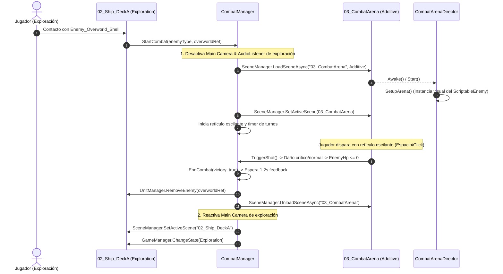

# 01.2 - Jerarquía de Unity y Estructura del Proyecto

Una estructura de carpetas limpia y una jerarquía de escena predecible son indispensables para evitar dependencias circulares, objetos huérfanos y desorden en el Inspector de Unity.

---

## 📁 Estructura del Proyecto (`Assets/`)

El árbol de carpetas en el proyecto de Unity sigue la convención estándar de la industria, optimizada para arquitectura basada en `ScriptableObjects` y sistemas desacoplados:

```
Assets/
├── _Scripts/
│   ├── Camera/               # Controlador de cámara en perspectiva 3D (CameraController)
│   ├── Combat/               # Lógica del combate por sincronización (Reticle, Gauge, Turns)
│   ├── Core/                 # GameManager, Systems, ResourceSystem, AudioSystem, StaticInstance
│   ├── Editor/               # Herramientas de generación y build (FunctionalTestingSceneBuilder)
│   ├── Exploration/          # Control 3D, puertas (DoorInteractable), cajas (PushableBox), escaleras (LadderZone)
│   ├── Interfaces/           # Contratos desacoplados (IDamageable, IInteractable, etc.)
│   ├── Inventory/            # Sistema de inventario, consumibles y soltado en 3D (DropItem)
│   ├── Managers/             # Gestores de escena (CombatManager, PartyManager, UnitManager)
│   ├── Scriptables/          # Definiciones de ScriptableObjects (Units, Weapons, Items)
│   ├── UI/                   # HUDs de exploración, maletín de inventario, canvas de combate y game over
│   ├── Units/                # Clases de unidades y cáscaras (HeroUnit, EnemyOverworldUnit, UnitBase)
│   └── Utilities/            # Helpers, Singletons genéricos, Extensiones, Constantes
├── Audio/
│   ├── Music/                # Pistas de exploración (Starlight), combate y suspense
│   └── SFX/                  # Disparos (Handgun, Shotgun), impactos, pasos, gemidos zombie
├── Prefabs/
│   ├── Core/                 # Prefab del objeto raíz [SYSTEMS] con DontDestroyOnLoad
│   ├── Enemies/              # Prefabs de zombies para exploración y visual de combate
│   ├── Heroes/               # Prefab de Barry, Leon, Lucia
│   └── UI/                   # Menú de inventario, HUD de vida, barra de retículo oscilante
├── Resources/
│   ├── Items/                # ScriptableItems cargados dinámicamente por ResourceSystem
│   ├── Units/                # ScriptableUnits (Barry, Leon, Lucia, ZombieMale, etc.)
│   └── Weapons/              # ScriptableWeapons (Cuchillo, Handgun, Shotgun, etc.)
├── Scenes/
│   ├── 00_Bootstrap          # Escena inicial liviana que carga los sistemas persistentes
│   ├── 01_Functional_Testing # Escena de validación funcional (puertas, escaleras, cajas, soltar ítems)
│   ├── 02_Ship_DeckA         # Primera zona de exploración narrativa (Corredor S.S. Starlight)
│   └── 03_CombatArena        # Escena aditiva para la vista de combate 3D
└── Sprites/
    ├── Characters/           # Spritesheets de personajes y zombies
    ├── Combat/               # Retícula, aguja blanca, fondos en 1ª persona, sprites de monstruos
    ├── Environment/          # Tilesets del barco (paredes, suelos metálicos, puertas)
    └── UI/                   # Iconos de armas, hierbas, sprays, marcos de estado
```

---

## 🌳 Jerarquía de Escenas en Unity (`Hierarchy`)

El proyecto organiza la exploración, las pruebas y el combate en escenas modulares registradas en `EditorBuildSettings`:

### 1. Escena de Pruebas Funcionales (`01_Functional_Testing.unity`)
```
Scene: 01_Functional_Testing
├── [=== PERSISTENT SYSTEMS ===]
│   └── Systems (Systems.cs, ResourceSystem.cs, AudioSystem.cs)
│
├── [=== SCENE MANAGERS ===]
│   ├── GameManager (Singleton - Máquina de estados global Game.Core)
│   ├── UnitManager (StaticInstance - Tracking de unidades)
│   ├── PartyManager (Singleton - Barry, Leon, Lucia)
│   ├── CombatManager (Singleton - Orquesta combate aditivo)
│   └── InventorySystem (Singleton - Maletín 8 casillas, municiones y DropItem)
│
├── [=== CAMERAS & LIGHTING ===]
│   ├── Main Camera (Perspectiva 3D, inclinación ~55°, CameraController)
│   └── Directional Light (Iluminación cenital de pruebas)
│
├── [=== ENVIRONMENT & TESTING GEOMETRY ===]
│   ├── Testing_Floor (Suelo 26x26m con Physics Collider)
│   ├── Wall_North / South / East / West (Paredes perimetrales de confinamiento)
│   ├── DividingWall_Left / Right (Muro divisorio central con 2 accesos de puertas)
│   ├── Door_Standard_Unlocked (DoorInteractable.cs - Apertura batiente con tecla E)
│   ├── Door_Security_Locked (DoorInteractable.cs - Requiere KeyCard_Level1)
│   ├── Staircase_Stairs (10 peldaños físicos de Y=0 a Y=3 navegables con stepOffset=0.45f)
│   ├── Ramp_Incline (Rampa continua de Y=0 a Y=3)
│   ├── Ladder_Vertical (Estructura de escalera con LadderZone.cs para escalado Y con W/S)
│   ├── Mezzanine_Platform (Plataforma elevada en Y=3 con barandillas perimetrales)
│   ├── Pushable_Crate_1 / 2 / 3 (PushableBox.cs - Rigidbody con FreezeRotation y FreezePositionY)
│   └── Pickups
│       ├── Pickup_GreenHerb (ItemPickup.cs, isTrigger = true)
│       ├── Pickup_FirstAidMed (ItemPickup.cs, isTrigger = true)
│       └── Pickup_KeyCard_Level1 (ItemPickup.cs, tarjeta de nivel 1 en Mezzanine)
│
├── [=== UNITS ===]
│   └── Player_HeroShell (HeroUnit.cs, CharacterController 3D, ExplorationController)
│
└── [=== UI_CANVAS ===]
    ├── HUD_Canvas (ExplorationHUD.cs - Salud, arma, munición)
    ├── Inventory_Canvas (InventoryUI.cs - Rejilla 8 casillas, debounce, soltar con [D]/[X])
    └── GameOver_Canvas (GameOverUI.cs)
```

### 2. Escena de Exploración Narrativa (`02_Ship_DeckA.unity`)
```
Scene: 02_Ship_DeckA
├── [=== PERSISTENT SYSTEMS ===]
│   └── Systems (Systems.cs, ResourceSystem.cs, AudioSystem.cs)
│
├── [=== SCENE MANAGERS ===]
│   ├── GameManager (Singleton - Máquina de estados global Game.Core)
│   ├── UnitManager (StaticInstance - Spawner de cáscaras Hero/Enemy)
│   ├── PartyManager (Singleton - Barry, Leon, Lucia)
│   ├── CombatManager (Singleton - Orquesta carga/descarga aditiva de 03_CombatArena)
│   └── InventorySystem (Singleton - Maletín de 8 casillas y munición)
│
├── [=== CAMERAS & LIGHTING ===]
│   ├── Main Camera (Perspectiva 3D, inclinación ~55°, CameraController)
│   └── Directional Light (Iluminación tenue de pasillo)
│
├── [=== ENVIRONMENT ===]
│   ├── Ship_Floor (Suelo 3D metálico con colisionador)
│   ├── Ship_Wall_Left / Right (Muros perimetrales 3D)
│   └── Pickup_GreenHerb (ItemPickup.cs, isTrigger = true, flotación senoidal)
│
├── [=== UNITS ===]
│   ├── PartyContainer
│   │   └── Player_HeroShell (HeroUnit.cs, CharacterController 3D)
│   └── EnemyContainer
│       └── Enemy_Overworld_Shell (EnemyOverworldUnit.cs, BoxCollider trigger)
│
└── [=== UI_CANVAS ===]
    ├── HUD_Canvas (ExplorationHUD.cs - Salud, arma y munición activa)
    ├── Inventory_Canvas (InventoryUI.cs - Rejilla de 8 casillas con debounce)
    └── GameOver_Canvas (GameOverUI.cs)
```

### 3. Escena Aditiva de Combate (`03_CombatArena.unity`)
```
Scene: 03_CombatArena (Cargada additivamente en runtime)
├── [=== COMBATE DIRECTOR ===]
│   └── CombatArenaDirector (CombatArenaDirector.cs - Configura arena y enemigo en Start/Enable)
│
├── [=== CAMERAS & LIGHTING ===]
│   ├── CombatCamera (Cámara 3D dedicada, perspectiva frontal)
│   ├── CombatSpotLight (Luz cenital focalizada de alta tensión)
│   └── FillLight (Luz de relleno tenue)
│
├── [=== ENVIRONMENT ===]
│   ├── Arena_Floor (Superficie 3D de combate)
│   ├── Arena_BackWall (Fondo oscuro)
│   ├── Arena_Wall_Left / Right (Límites laterales)
│   └── EnemySpawnPoint (Anclaje donde se proyecta la cápsula/modelo del enemigo)
│
└── [=== UI_CANVAS ===]
    └── Combat_Canvas (CombatUI.cs - Barra de retículo oscilante 0..120px, semitransparente)
```

---

## 🚀 Flujo Multi-Escena: Instancia de Combate Aditiva (Estilo *Persona*)



> [!important] Carga de Emergencia para Pruebas Rápidas
> Si un programador le da a **Play** directamente en `01_Functional_Testing` o `02_Ship_DeckA`, `GameManager` comprueba:
> ```csharp
> if (Systems.Instance == null) {
>     Instantiate(Resources.Load<GameObject>("Systems_Bootstrap"));
> }
> ```
> Esto previene errores de referencia nula (`NullReferenceException`) durante pruebas aisladas de habitaciones o combates.

---

## 📑 Siguiente Paso Recomendado
Revisar el ciclo de vida de la máquina de estados en [[01.3 - Ciclo de Vida y Maquina de Estados Global]].
