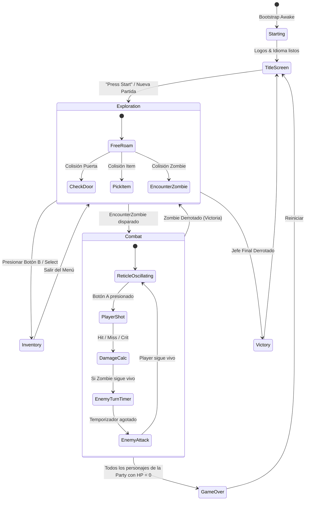

# 01.3 - Ciclo de Vida y Máquina de Estados Global (Game Loop)

## 🕹️ Del Ciclo SM83 de Game Boy a Unity

En el código original desensamblado de Game Boy Color (`decompgaiden/src/state_machine.c` y `re_gaiden.h`):
- El bucle principal se ejecuta sincrónicamente sincronizado a 60 FPS con el pulso **VBlank** del procesador SM83 (Banco `00`: `0x2AE9`).
- Una variable global de estado (`game->state`, mapeada a la RAM en `0xC192..0xC194` y `0xC2E1`) bifurcaba el ciclo en cada fotograma mediante un `switch-case`.

En **Unity**, trasladamos esta máquina de estados a un gestor de alto nivel ([[02.2 - Game Manager y Arquitectura de Estados|GaidenGameManager]]) acoplado al bucle de eventos (`Update()`, `FixedUpdate()`) y orquestado mediante **Delegados y Eventos** (`Action<GameState>`), aplicando los fundamentos de [[04.5 - Arquitectura Basada en Eventos y Delegados]].

---

## 🔄 Diagrama de Transición de Estados



---

## 📊 Enumeración de Estados (`GaidenGameState`)

En C# definimos los estados del juego basándonos en la decompilación:

```csharp
namespace Gaiden.Core {
    public enum GaidenGameState {
        Starting        = 0, // Carga de sistemas y assets iniciales
        IntroLogos      = 1, // Pantallas de Capcom / M4
        TitleScreen     = 2, // Menú principal y selección de idioma
        Exploration     = 3, // Exploración 2D cenital en los camarotes/cubiertas
        Combat          = 4, // Modo combate 1ª persona con retículo oscilante
        Inventory       = 5, // Pantalla de objetos, curación y equipo de armas
        GameOver        = 6, // Derrota total del grupo
        Victory         = 7  // Secuencia de escape y créditos
    }
}
```

---

## ⚡ Patrón de Notificación: Before y After State Changed

Para permitir que los subsistemas preparen o limpien sus recursos de forma desacoplada antes y después de cada cambio de estado, el gestor expone dos eventos estáticos:

```csharp
public static event Action<GaidenGameState> OnBeforeStateChanged;
public static event Action<GaidenGameState> OnAfterStateChanged;
```

### Tabla de Responsabilidades por Estado:

| Estado | Acciones en `OnBeforeStateChanged` | Acciones en `OnAfterStateChanged` |
| :--- | :--- | :--- |
| **`Exploration`** | Ocultar canvas de combate. Reactivar colisiones del jugador. | Encender cámara 2D. Iniciar música ambiental del trasatlántico. |
| **`Combat`** | Pausar movimiento del jugador. Capturar datos del zombie contactado. | Activar canvas de combate en 1ª persona. Iniciar oscilación de la aguja. Cambiar a música de tensión. |
| **`Inventory`** | Congelar tiempo de juego (`Time.timeScale = 0` o pausar movimiento). | Mostrar UI del maletín de 8 casillas. Refrescar lista de munición y estado de veneno. |
| **`GameOver`** | Detener oscilador del combate y silenciar música. | Disparar sonido de muerte de Resident Evil. Mostrar pantalla roja de "You are dead". |

---

## 📑 Siguiente Paso Recomendado
Examinar la implementación técnica del patrón Singleton y los gestores en [[02.1 - Patron Singleton y Gestores]].
