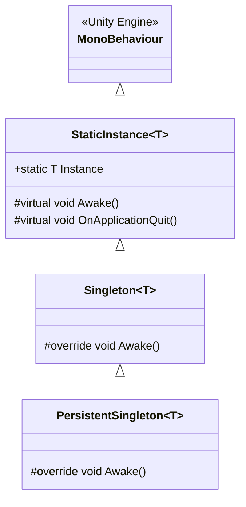

# 02.1 - Patrón Singleton y Gestores

En la arquitectura de `Assets/_Scripts/Utilities/StaticInstance.cs`, se implementa una jerarquía de clases genéricas abstractas fundamentada en la **Herencia** ([[04.3 - Herencia e Interfaces en la Arquitectura]]) y las **Restricciones Genéricas** ([[04.4 - Genericos y Colecciones en el Motor de Juego]]).

Esta jerarquía resuelve uno de los problemas clásicos de Unity: **¿cómo tener acceso estático global a un MonoBehaviour sin duplicar instancias al cambiar de escena ni generar referencias nulas al reiniciar?**

---

## 📐 Jerarquía de Clases Genéricas



---

## 🔍 Análisis Detallado de las Variantes

### 1. `StaticInstance<T>` (Instancia Estática Sobrescribible)
```csharp
public abstract class StaticInstance<T> : MonoBehaviour where T : MonoBehaviour {
    public static T Instance { get; private set; }
    protected virtual void Awake() => Instance = this as T;

    protected virtual void OnApplicationQuit() {
        Instance = null;
        Destroy(gameObject);
    }
}
```
- **Comportamiento**: Guarda la referencia estática de la clase. Si se crea una nueva instancia (por ejemplo, al recargar la escena), **la nueva instancia sobrescribe la anterior**.
- **Ventaja**: No requiere limpieza manual de estado al reiniciar la escena. Es ideal para gestores atados al ciclo de vida de una sola escena.
- **Cuándo usar en Gaiden**:
  - `UnitManager`: Administra la lista de zombies y personajes instanciados en la cubierta actual del barco.
  - `ReticleController`: Controla la aguja oscilante en la pantalla de combate actual.

---

### 2. `Singleton<T>` (Instancia Única Exclusiva)
```csharp
public abstract class Singleton<T> : StaticInstance<T> where T : MonoBehaviour {
    protected override void Awake() {
        if (Instance != null) {
            Destroy(gameObject);
            return;
        }
        base.Awake();
    }
}
```
- **Comportamiento**: Si ya existe una instancia activa, cualquier nueva copia creada (por error en la jerarquía o instanciación accidental) se **autodestruye inmediatamente**.
- **Ventaja**: Garantiza unicidad absoluta durante el tiempo de vida de la escena.
- **Cuándo usar en Gaiden**:
  - `GaidenGameManager`: Debe existir exactamente un gestor de estados por escena.
  - `InventoryUI`: Controlador de la ventana del maletín que no debe duplicarse.

---

### 3. `PersistentSingleton<T>` (Instancia Persistente Entre Escenas)
```csharp
public abstract class PersistentSingleton<T> : Singleton<T> where T : MonoBehaviour {
    protected override void Awake() {
        base.Awake();
        DontDestroyOnLoad(gameObject);
    }
}
```
- **Comportamiento**: Además de garantizar unicidad destruyendo duplicados, invoca `DontDestroyOnLoad(gameObject)`.
- **Ventaja**: El GameObject raíz sobrevive a las llamadas de `SceneManager.LoadScene()`. Su estado en memoria (música reproduciéndose, recursos cacheados, estado de la partida) permanece intacto.
- **Cuándo usar en Gaiden**:
  - `Systems`: Objeto raíz que contiene los subsistemas centrales.
  - `AudioSystem`: Mantiene la música sonando durante transiciones entre habitaciones o entre exploración y combate.
  - `ResourceSystem`: Mantiene el diccionario de ScriptableObjects cargado en memoria RAM.

---

## 🛡️ Buenas Prácticas y Prevención de Errores

> [!warning] Cuidado con los Métodos Awake() en Clases Derivadas
> Si una clase derivada (por ejemplo, `AudioSystem`) sobreescribe `Awake()`, **SIEMPRE** debe llamar a `base.Awake()` en la primera línea. Si lo olvida, `Instance` quedará en `null` o no se llamará `DontDestroyOnLoad()`.

```csharp
public class AudioSystem : PersistentSingleton<AudioSystem> {
    protected override void Awake() {
        base.Awake(); // <-- ¡OBLIGATORIO!
        InitializeAudioSources();
    }
}
```

> [!tip] Limpieza en OnApplicationQuit
> La implementación de `OnApplicationQuit()` en `StaticInstance` previene el error clásico de Unity donde llamadas estáticas durante el cierre de la aplicación intentan acceder a objetos destruidos en el Editor.

---

## 📑 Siguiente Paso Recomendado
Ver cómo `GaidenGameManager` implementa este patrón en [[02.2 - Game Manager y Arquitectura de Estados]].
