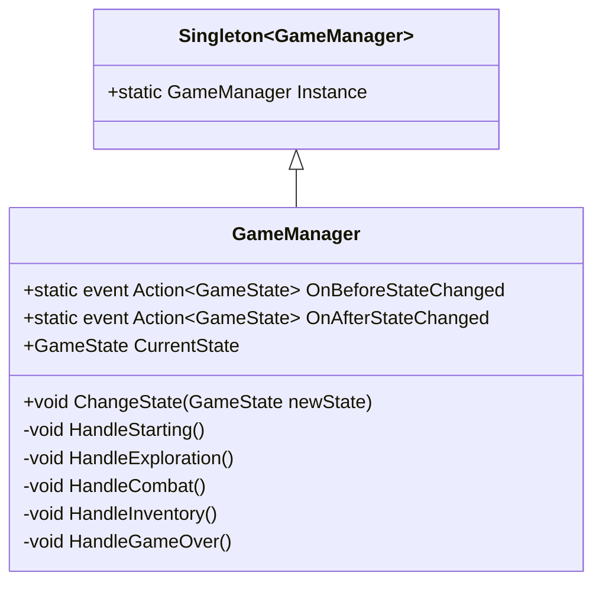

# 02.2 - Game Manager y Arquitectura de Estados (GameManager)

El `GameManager` es el cerebro coordinador del ciclo de juego. Hereda de `Singleton<GameManager>` y centraliza las transiciones entre la exploración, los combates por turnos y los menús de inventario.

---

## 🏗️ Estructura del Gestor



---

## 💻 Implementación C# (`GameManager.cs`)

```csharp
using System;
using UnityEngine;

namespace Game.Core {
    public class GameManager : Singleton<GameManager> {
        public static event Action<GameState> OnBeforeStateChanged;
        public static event Action<GameState> OnAfterStateChanged;

        public GameState CurrentState { get; private set; }

        private void Start() {
            // Arranca el juego en el estado inicial
            ChangeState(GameState.Starting);
        }

        public void ChangeState(GameState newState) {
            if (CurrentState == newState) return;

            // 1. Notifica a los suscriptores ANTES del cambio (para guardar datos o pausar)
            OnBeforeStateChanged?.Invoke(newState);

            CurrentState = newState;

            // 2. Ejecuta la lógica interna del estado
            switch (newState) {
                case GameState.Starting:
                    HandleStarting();
                    break;
                case GameState.TitleScreen:
                    HandleTitleScreen();
                    break;
                case GameState.Exploration:
                    HandleExploration();
                    break;
                case GameState.Combat:
                    HandleCombat();
                    break;
                case GameState.Inventory:
                    HandleInventory();
                    break;
                case GameState.GameOver:
                    HandleGameOver();
                    break;
                case GameState.Victory:
                    HandleVictory();
                    break;
                default:
                    throw new ArgumentOutOfRangeException(nameof(newState), newState, null);
            }

            // 3. Notifica a los suscriptores DESPUÉS del cambio (para reactivar controles o UI)
            OnAfterStateChanged?.Invoke(newState);

            Debug.Log($"[GameManager] Estado cambiado a: {newState}");
        }

        private void HandleStarting() {
            // Asegura que Systems esté cargado y cambia a pantalla de título o exploración
            ChangeState(GameState.Exploration);
        }

        private void HandleTitleScreen() {
            Time.timeScale = 1f;
        }

        private void HandleExploration() {
            Time.timeScale = 1f;
            // Reactivar controles y cámara de exploración
        }

        private void HandleCombat() {
            // En combate, la exploración se suspende y se activa el panel del retículo y la arena 3D
        }

        private void HandleInventory() {
            // El inventario suspende el movimiento pero permite cambiar de arma, curarse o soltar ítems
        }

        private void HandleGameOver() {
            Debug.Log("GAME OVER: Barry y su grupo han caído.");
        }

        private void HandleVictory() {
            Debug.Log("VICTORIA: Has sobrevivido a la pesadilla.");
        }
    }
}
```

---

## 🔌 Suscripción Desacoplada a Eventos

Siguiendo los principios de la [[04.5 - Arquitectura Basada en Eventos y Delegados|Arquitectura Basada en Eventos y Delegados]], otros componentes nunca necesitan consultar por sondeo (`polling`) en su método `Update()`. En su lugar, se suscriben a los eventos:

```csharp
public class ExplorationController : MonoBehaviour {
    private void OnEnable() {
        GameManager.OnAfterStateChanged += OnStateChanged;
    }

    private void OnDisable() {
        GameManager.OnAfterStateChanged -= OnStateChanged;
    }

    private void OnStateChanged(GameState newState) {
        // Habilitar o deshabilitar input de exploración según el estado
        enabled = (newState == GameState.Exploration);
    }
}
```

> [!important] Prevención de Fugas de Memoria (Memory Leaks)
> Siempre que te suscribas a un delegado o evento estático (`+=`), debes **desuscribirte** (`-=`) en `OnDisable()` u `OnDestroy()`. De lo contrario, el recolector de basura de Unity no podrá liberar la memoria del componente aunque la escena se destruya.

---

## 📑 Siguiente Paso Recomendado
Ver el contenedor de sistemas persistentes en [[02.3 - Sistemas Persistentes y Bootstrap]].
