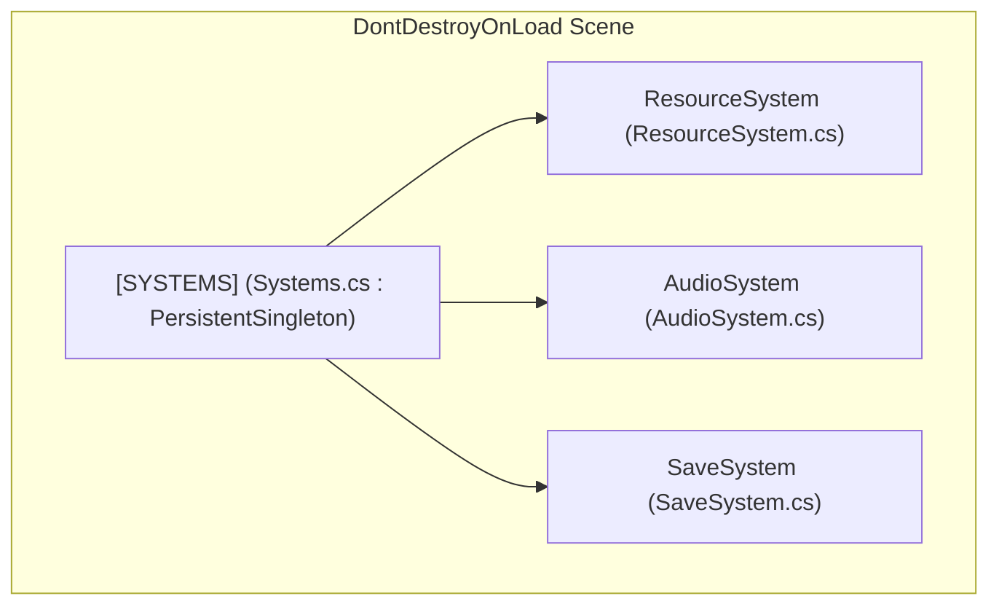

# 02.3 - Sistemas Persistentes y Bootstrap (Systems Container)

En proyectos de Unity de mediana a gran envergadura, tener múltiples GameObjects sueltos con `DontDestroyOnLoad` contamina la raíz de la jerarquía (`DontDestroyOnLoad Scene`) y complica el orden de inicialización.

La arquitectura de `Assets/_Scripts/Systems/Systems.cs` adopta el patrón **Persistent Root Container** (Contenedor Raíz Persistente).

---

## 🏛️ El Concepto del Contenedor `Systems`

En lugar de aplicar `DontDestroyOnLoad` individualmente a cada gestor:
1. Se crea un GameObject único llamado `[SYSTEMS]`.
2. A este objeto se le asigna el componente `Systems` (que hereda de `PersistentSingleton<Systems>`).
3. Todos los subsistemas globales (`ResourceSystem`, `AudioSystem`, `SaveSystem`) se ubican como **hijos jerárquicos** (`Children`) de `[SYSTEMS]`.



Al aplicar `DontDestroyOnLoad` sobre el objeto padre, **todos los hijos se vuelven persistentes automáticamente**, manteniendo el árbol de objetos limpio y ordenado.

---

## 💻 Código Fuente de `Systems.cs`

```csharp
using UnityEngine;

namespace Game.Core {
    /// <summary>
    /// Contenedor raíz persistente. Mantiene vivos todos los subsistemas esenciales
    /// a través de las cargas de escenas (pantalla de título, camarotes, combate).
    /// </summary>
    public class Systems : PersistentSingleton<Systems> {
        [RuntimeInitializeOnLoadMethod(RuntimeInitializeLoadType.BeforeSceneLoad)]
        private static void AutoInitializeBootstrap() {
            // Permite que el sistema se autoinstancie si el desarrollador inicia el juego
            // desde cualquier escena de prueba sin pasar por la escena 00_Bootstrap
            if (Instance == null) {
                var prefab = Resources.Load<GameObject>("Systems");
                if (prefab != null) {
                    var instance = Instantiate(prefab);
                    instance.name = "[SYSTEMS]";
                } else {
                    Debug.LogWarning("[Systems] No se encontró el prefab 'Systems' en Resources. Creando objeto vacío.");
                    var go = new GameObject("[SYSTEMS]");
                    go.AddComponent<Systems>();
                }
            }
        }
    }
}
```

---

## 🌟 Ventajas del Patrón Bootstrap con Auto-Inicialización

1. **Testeo Inmediato en Cualquier Escena**:
   - Gracias al atributo `[RuntimeInitializeOnLoadMethod(RuntimeInitializeLoadType.BeforeSceneLoad)]`, Unity ejecuta este método antes de cargar cualquier escena, garantizando que `Systems.Instance`, `AudioSystem.Instance` y `ResourceSystem.Instance` estén listos aunque se pulse Play en la escena de una batalla o un pasillo.
2. **Acceso Rápido y Centralizado**:
   - Cualquier script puede acceder a los sistemas globales mediante `AudioSystem.Instance` o `ResourceSystem.Instance` con coste $O(1)$ sin búsquedas lentas de tipo `FindObjectOfType<T>()`.
3. **Persistencia Garantizada**:
   - Cuando el jugador cruza una puerta que carga otra escena (`SceneManager.LoadSceneAsync("Deck_B")`), la música no se corta y los datos no se reinician.

---

## 📑 Siguiente Paso Recomendado
Ver cómo se administran los datos y ScriptableObjects en [[02.4 - Sistema de Recursos y ScriptableObjects]].
