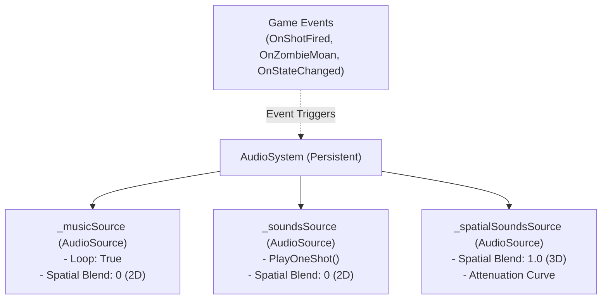

# 02.5 - Sistema de Audio 2D-3D (AudioSystem)

En un juego de *Survival Horror* como *Resident Evil Gaiden*, el audio es fundamental para crear tensión: desde el silencio inquietante de los pasillos del *S.S. Starlight*, el chasquido del percutor al quedarse sin munición (`*CLICK*`), el sonido seco de una escopeta o el alarido de un zombie al ser impactado.

El `AudioSystem` se apoya en `StaticInstance<AudioSystem>` (o como hijo de `Systems`) y ofrece soporte para **música ambiental en bucle**, **efectos de sonido 2D** y **sonidos posicionales 3D**.

---

## 🏗️ Diagrama de Componentes de Audio



---

## 💻 Implementación C# de `AudioSystem.cs` para Gaiden

```csharp
using System.Collections;
using UnityEngine;

namespace Gaiden.Core {
    public class AudioSystem : StaticInstance<AudioSystem> {
        [Header("Audio Sources")]
        [SerializeField] private AudioSource _musicSource;
        [SerializeField] private AudioSource _soundsSource;
        [SerializeField] private AudioSource _spatialSoundsSource;

        [Header("Clips Globales de Gaiden")]
        [SerializeField] private AudioClip _emptyGunClick;
        [SerializeField] private AudioClip _criticalHitSfx;
        [SerializeField] private AudioClip _playerHurtSfx;
        [SerializeField] private AudioClip _doorOpenSfx;

        // Reproducción de música con transición suave (Cross-fade)
        public void PlayMusic(AudioClip clip, float fadeDuration = 0.5f) {
            if (_musicSource.clip == clip) return;
            StartCoroutine(FadeMusicRoutine(clip, fadeDuration));
        }

        private IEnumerator FadeMusicRoutine(AudioClip nextClip, float duration) {
            float startVol = _musicSource.volume;
            // Desvanecer música actual
            for (float t = 0; t < duration; t += Time.deltaTime) {
                _musicSource.volume = Mathf.Lerp(startVol, 0f, t / duration);
                yield return null;
            }
            _musicSource.Stop();
            _musicSource.clip = nextClip;
            _musicSource.Play();
            // Subir volumen de la nueva música
            for (float t = 0; t < duration; t += Time.deltaTime) {
                _musicSource.volume = Mathf.Lerp(0f, startVol, t / duration);
                yield return null;
            }
            _musicSource.volume = startVol;
        }

        // Efectos 2D (UI, disparos, impactos de retículo)
        public void PlaySound(AudioClip clip, float vol = 1f) {
            if (clip == null) return;
            _soundsSource.PlayOneShot(clip, vol);
        }

        // Efectos 3D (Gemidos lejanos de zombies en pasillos)
        public void PlaySound3D(AudioClip clip, Vector3 position, float vol = 1f) {
            if (clip == null) return;
            _spatialSoundsSource.transform.position = position;
            _spatialSoundsSource.PlayOneShot(clip, vol);
        }

        // Métodos de conveniencia para eventos de combate de Gaiden
        public void PlayEmptyClick() => PlaySound(_emptyGunClick);
        public void PlayCriticalHit() => PlaySound(_criticalHitSfx);
        public void PlayPlayerHurt() => PlaySound(_playerHurtSfx);
        public void PlayDoorOpen() => PlaySound(_doorOpenSfx);
    }
}
```

---

## ⚡ Integración Desacoplada con Eventos de Juego

Para mantener el sistema completamente desacoplado (siguiendo los principios de la [[04.5 - Arquitectura Basada en Eventos y Delegados|Arquitectura Basada en Eventos y Delegados]]), el `AudioSystem` puede escuchar los eventos de disparo del `CombatManager` sin que `CombatManager` conozca detalles de la implementación del reproductor de sonido:

```csharp
private void OnEnable() {
    CombatManager.OnShotFired += HandleShotFired;
    CombatManager.OnEnemyHit += HandleEnemyHit;
}

private void OnDisable() {
    CombatManager.OnShotFired -= HandleShotFired;
    CombatManager.OnEnemyHit -= HandleEnemyHit;
}

private void HandleShotFired(ScriptableWeapon weapon, bool hasAmmo) {
    if (!hasAmmo) {
        PlayEmptyClick();
    } else {
        PlaySound(weapon.FireSound);
    }
}

private void HandleEnemyHit(HitOutcome outcome) {
    if (outcome == HitOutcome.Critical) {
        PlayCriticalHit();
    }
}
```

---

## 📑 Siguiente Paso Recomendado
Examinar el gestor de unidades en [[02.6 - Gestor de Unidades y Spawning]].
