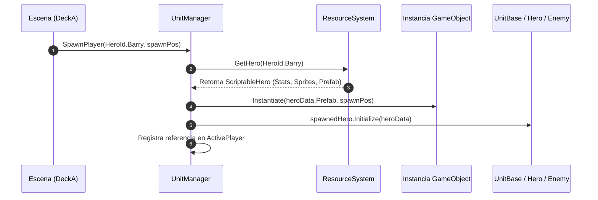

# 02.6 - Gestor de Unidades y Spawning (UnitManager)

El `UnitManager` es un gestor específico de escena que hereda de `StaticInstance<UnitManager>`. Su propósito principal es coordinar la instanciación (`Instantiate`), configuración de estadísticas y registro de las unidades activas en la escena actual (personajes jugables y zombies en el mapa).

Este sistema interactúa directamente con el [[02.4 - Sistema de Recursos y ScriptableObjects|ResourceSystem]] y las clases de entidad que derivan de `UnitBase` (analizadas en [[04.3 - Herencia e Interfaces en la Arquitectura]]).

---

## 🏗️ Flujo de Spawning e Inicialización



---

## 💻 Implementación de `UnitManager.cs`

```csharp
using System.Collections.Generic;
using UnityEngine;
using Game.Core;
using Game.Units;

namespace Game.Managers {
    public class UnitManager : StaticInstance<UnitManager> {
        [Header("Contenedores de Jerarquía")]
        [SerializeField] private Transform _heroesParent;
        [SerializeField] private Transform _enemiesParent;

        // Referencias en escena
        public HeroUnit ActivePlayer { get; private set; }
        public List<EnemyOverworldUnit> ActiveEnemies { get; private set; } = new List<EnemyOverworldUnit>();

        /// <summary>
        /// Instancia al protagonista en el mapa cenital a partir del ScriptableObject
        /// </summary>
        public HeroUnit SpawnPlayer(HeroId heroId, Vector3 spawnPosition) {
            var heroData = ResourceSystem.Instance.GetHero(heroId);
            if (heroData == null) {
                Debug.LogError($"[UnitManager] No se encontraron datos para {heroId}");
                return null;
            }

            var go = Instantiate(heroData.Prefab, spawnPosition, Quaternion.identity, _heroesParent);
            go.name = $"Player_{heroData.CharacterName}";

            var heroUnit = go.GetComponent<HeroUnit>();
            heroUnit.Initialize(heroData);

            ActivePlayer = heroUnit;
            return heroUnit;
        }

        /// <summary>
        /// Genera un enemigo en las coordenadas del mapa
        /// </summary>
        public EnemyOverworldUnit SpawnEnemy(EnemyType enemyType, Vector3 spawnPosition) {
            var enemyData = ResourceSystem.Instance.GetEnemy(enemyType);
            if (enemyData == null) {
                Debug.LogError($"[UnitManager] No se encontraron datos para el enemigo {enemyType}");
                return null;
            }

            var go = Instantiate(enemyData.OverworldPrefab, spawnPosition, Quaternion.identity, _enemiesParent);
            go.name = $"Enemy_{enemyData.EnemyName}_{ActiveEnemies.Count}";

            var enemyUnit = go.GetComponent<EnemyOverworldUnit>();
            enemyUnit.Initialize(enemyData);

            ActiveEnemies.Add(enemyUnit);
            return enemyUnit;
        }

        /// <summary>
        /// Limpia a un enemigo del mapa tras haber sido derrotado en combate
        /// </summary>
        public void RemoveEnemy(EnemyOverworldUnit enemy) {
            if (ActiveEnemies.Contains(enemy)) {
                ActiveEnemies.Remove(enemy);
                Destroy(enemy.gameObject);
            }
        }
    }
}
```

---

## 🔗 Vinculación con los Fundamentos de POO

1. **Inyección de Dependencias Limpia**:
   - `UnitManager` no tiene campos serializados para cada zombie del juego. Todo se solicita al `ResourceSystem` mediante enumerados fuertemente tipados (`HeroId`, `EnemyType`).
2. **Polimorfismo en Acción**:
   - Tanto `HeroUnit` como `EnemyOverworldUnit` heredan de `UnitBase`. Los sistemas que aplican daño o consultan si la unidad está viva solo necesitan tratar con `UnitBase` o la interfaz `IDamageable`.

---

## 📑 Siguiente Paso Recomendado
Ver las funciones de apoyo en [[02.7 - Utilidades y Extensiones]].
