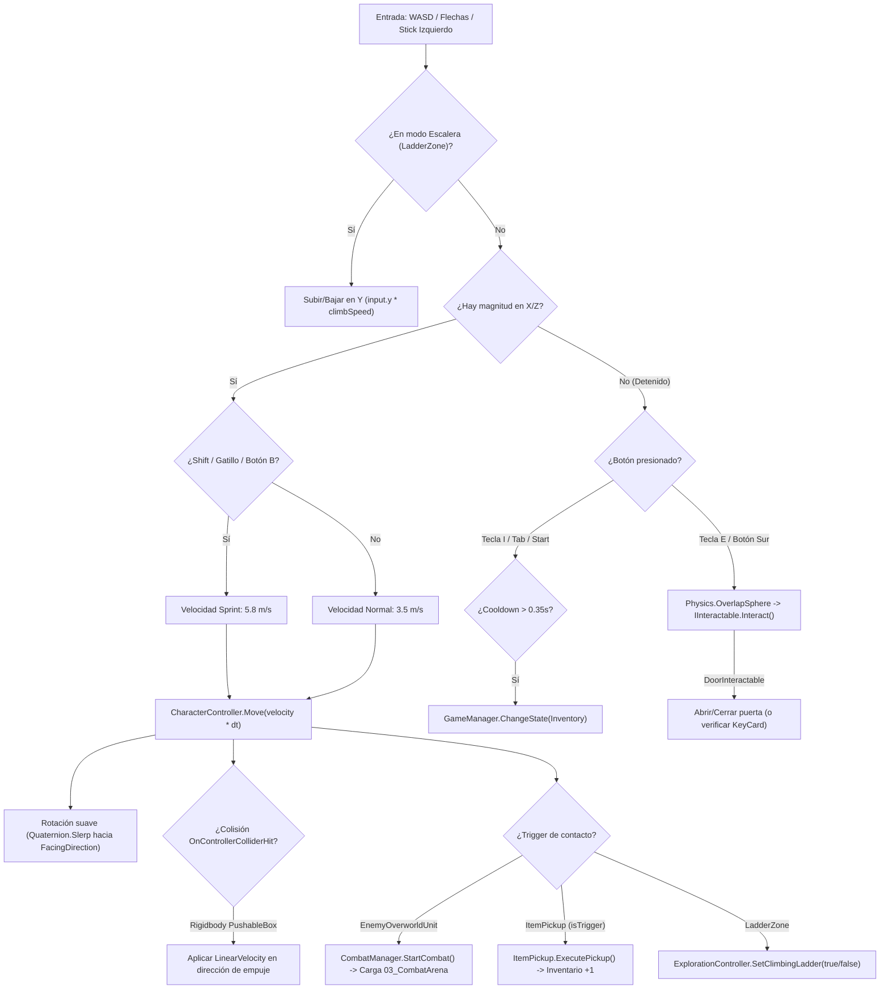

# 03.1 - Sistema de Exploración 2D (Exploration Controller)

## 🗺️ Reconstrucción: Exploración Top-Down en Perspectiva 3D

En la arquitectura modernizada en Unity:
- Se implementa una **perspectiva 3D cenital** con inclinación angular fija de $\approx 55^\circ$, profundidad tridimensional, sombras en tiempo real e iluminación de alta atmósfera.
- El movimiento se traslada al espacio $X/Z$ utilizando `CharacterController` con soporte de física vertical (gravedad), rotación suave hacia el vector de avance y soporte nativo para escalones (`stepOffset = 0.45f`, `slopeLimit = 50f`).
- La cámara se orquesta mediante `CameraController.cs` (`Game.Cameras`), con proyección en perspectiva, seguimiento cinemático suave (`Vector3.SmoothDamp`), y anticipación de movimiento (*look-ahead*).
- Detección de interacción tridimensional mediante `Physics.OverlapSphere` para cofres, puertas y objetos interactivos (`IInteractable`).
- Entrada totalmente migrada a **`UnityEngine.InputSystem`**, soportando simultáneamente teclado (WASD / Flechas), ratón y gamepads (Xbox / PlayStation).
- Nuevas mecánicas probadas y validadas en la escena `01_Functional_Testing.unity`:
  1. **Interacción con Puertas (`DoorInteractable.cs`)**: Puertas batientes y correderas con apertura suave, estados bloqueados/desbloqueados y verificación de llaves/tarjetas (`ItemId.KeyCard_Level1`).
  2. **Verticalidad y Escaleras (`LadderZone.cs`)**: Navegación por escaleras y rampas físicas con `stepOffset`, más zonas de escaleras de mano verticales con cambio a modo de escalada (subida/bajada en Y con W/S e inmunidad a gravedad).
  3. **Empuje de Cajas (`PushableBox.cs`)**: Cajas físicas pesadas empujables mediante `OnControllerColliderHit`, con restricciones angulares y amortiguación lineal.

---

## 🏗️ Diagrama de Flujo de Entrada y Mecánicas de Exploración 3D



---

## 💻 Implementación en Unity C# (`ExplorationController.cs`)

```csharp
using UnityEngine;
using UnityEngine.InputSystem;
using Game.Core;
using Game.Interfaces;

namespace Game.Exploration {
    /// <summary>
    /// Controlador de exploración en perspectiva Top-Down.
    /// Movimiento en el plano 3D (X/Z), rotación suave hacia la dirección de avance,
    /// sprint, interacción 3D, soporte para escaleras/verticalidad y empuje de cajas físicas.
    /// </summary>
    [RequireComponent(typeof(CharacterController))]
    public class ExplorationController : MonoBehaviour {
        [Header("Velocidad de Movimiento")]
        [SerializeField] private float _walkSpeed = 3.5f;
        [SerializeField] private float _sprintSpeed = 5.8f;
        [SerializeField] private float _rotationSpeed = 12f;

        [Header("Detección de Interacción")]
        [SerializeField] private float _interactionRadius = 1.6f;
        [SerializeField] private float _interactionDistance = 0.8f;
        [SerializeField] private LayerMask _interactLayers = ~0;

        [Header("Física y Verticalidad")]
        [SerializeField] private float _gravity = -15f;
        [SerializeField] private float _stepOffset = 0.45f;
        [SerializeField] private float _slopeLimit = 50f;
        [SerializeField] private float _boxPushPower = 2.5f;

        private CharacterController _characterController;
        private Vector3 _moveDirection;
        private float _verticalVelocity;
        private bool _isSprinting;
        private float _lastInventoryToggleTime;
        private bool _isClimbingLadder;
        private float _ladderClimbSpeed = 3f;

        public Vector3 FacingDirection { get; private set; } = Vector3.forward;
        public bool IsMoving => _moveDirection.sqrMagnitude > 0.01f;
        public bool IsClimbingLadder => _isClimbingLadder;

        private void Awake() {
            _characterController = GetComponent<CharacterController>();
            if (_characterController != null) {
                _characterController.center = Vector3.zero;
                _characterController.height = 2f;
                _characterController.radius = 0.4f;
                _characterController.stepOffset = _stepOffset;
                _characterController.slopeLimit = _slopeLimit;
            }
        }

        private void Update() {
            if (GameManager.Instance != null && GameManager.Instance.CurrentState != GameState.Exploration) {
                _moveDirection = Vector3.zero;
                return;
            }

            HandleInput();
            HandleInteractionInput();
        }

        private void FixedUpdate() {
            ApplyMovement();
        }

        private void HandleInput() {
            Vector2 inputVector = Vector2.zero;
            var keyboard = Keyboard.current;
            if (keyboard != null) {
                if (keyboard.wKey.isPressed || keyboard.upArrowKey.isPressed) inputVector.y += 1f;
                if (keyboard.sKey.isPressed || keyboard.downArrowKey.isPressed) inputVector.y -= 1f;
                if (keyboard.aKey.isPressed || keyboard.leftArrowKey.isPressed) inputVector.x -= 1f;
                if (keyboard.dKey.isPressed || keyboard.rightArrowKey.isPressed) inputVector.x += 1f;
            }

            var gamepad = Gamepad.current;
            if (gamepad != null) {
                Vector2 stick = gamepad.leftStick.ReadValue();
                if (stick.sqrMagnitude > 0.04f) inputVector = stick;
                else {
                    Vector2 dpad = gamepad.dpad.ReadValue();
                    if (dpad.sqrMagnitude > 0.04f) inputVector = dpad;
                }
            }

            if (_isClimbingLadder) {
                _verticalVelocity = inputVector.y * _ladderClimbSpeed;
                _moveDirection = new Vector3(inputVector.x * 0.5f, 0f, 0f);
            } else {
                Vector3 rawDir = new Vector3(inputVector.x, 0f, inputVector.y);
                _moveDirection = rawDir.sqrMagnitude > 1f ? rawDir.normalized : rawDir;

                _isSprinting = (keyboard != null && (keyboard.leftShiftKey.isPressed || keyboard.rightShiftKey.isPressed))
                            || (gamepad != null && (gamepad.buttonEast.isPressed || gamepad.leftStickButton.isPressed || gamepad.rightTrigger.isPressed));

                if (_moveDirection.sqrMagnitude > 0.001f) {
                    FacingDirection = _moveDirection.normalized;
                    Quaternion targetRotation = Quaternion.LookRotation(FacingDirection, Vector3.up);
                    transform.rotation = Quaternion.Slerp(transform.rotation, targetRotation, _rotationSpeed * Time.deltaTime);
                }
            }

            bool openInventory = (keyboard != null && (keyboard.iKey.wasPressedThisFrame || keyboard.tabKey.wasPressedThisFrame))
                              || (gamepad != null && (gamepad.startButton.wasPressedThisFrame || gamepad.selectButton.wasPressedThisFrame));

            if (openInventory && (Time.unscaledTime - _lastInventoryToggleTime > 0.35f) && GameManager.Instance != null) {
                _lastInventoryToggleTime = Time.unscaledTime;
                GameManager.Instance.ChangeState(GameState.Inventory);
            }
        }

        private void ApplyMovement() {
            if (_characterController == null) return;
            float currentSpeed = _isSprinting ? _sprintSpeed : _walkSpeed;
            Vector3 velocity = _moveDirection * currentSpeed;

            if (_isClimbingLadder) {
                velocity.y = _verticalVelocity;
            } else {
                if (_characterController.isGrounded) _verticalVelocity = -1f;
                else _verticalVelocity += _gravity * Time.fixedDeltaTime;
                velocity.y = _verticalVelocity;
            }

            _characterController.Move(velocity * Time.fixedDeltaTime);
        }

        private void HandleInteractionInput() {
            bool interactPressed = (Keyboard.current != null && Keyboard.current.eKey.wasPressedThisFrame)
                                || (Mouse.current != null && Mouse.current.leftButton.wasPressedThisFrame)
                                || (Gamepad.current != null && (Gamepad.current.buttonSouth.wasPressedThisFrame || Gamepad.current.buttonWest.wasPressedThisFrame));

            if (interactPressed) {
                Vector3 center = transform.position + Vector3.up * 0.3f + (FacingDirection * _interactionDistance);
                Collider[] colliders = Physics.OverlapSphere(center, _interactionRadius, _interactLayers);
                foreach (var col in colliders) {
                    if (col.gameObject == gameObject) continue;
                    if (col.TryGetComponent<IInteractable>(out var interactable)) {
                        interactable.Interact(this);
                        break;
                    }
                }
            }
        }

        private void OnControllerColliderHit(ControllerColliderHit hit) {
            var body = hit.collider.attachedRigidbody;
            if (body == null || body.isKinematic) return;
            if (hit.normal.y > 0.6f) return; // Ignorar suelo

            Vector3 pushDir = new Vector3(hit.moveDirection.x, 0f, hit.moveDirection.z);
            if (pushDir.sqrMagnitude < 0.001f) {
                pushDir = -hit.normal;
                pushDir.y = 0f;
            }
            if (pushDir.sqrMagnitude < 0.001f) return;

            float power = _boxPushPower;
            var pushable = hit.collider.GetComponent<PushableBox>();
            if (pushable != null) power = pushable.PushForce;

            body.linearVelocity = pushDir.normalized * power;
        }

        public void SetClimbingLadder(bool isClimbing) {
            _isClimbingLadder = isClimbing;
            if (isClimbing) _verticalVelocity = 0f;
        }
    }
}
```

---

## 📷 Controlador de Cámara en Perspectiva (`CameraController.cs`)

```csharp
using UnityEngine;

namespace Game.Cameras {
    /// <summary>
    /// Cámara de perspectiva cenital / alta angulación (~55° pitch).
    /// </summary>
    [ExecuteAlways]
    [RequireComponent(typeof(Camera))]
    public class CameraController : MonoBehaviour {
        [Header("Objetivo a Seguir")]
        [SerializeField] private Transform _target;

        [Header("Configuración de Posición y Ángulo")]
        [SerializeField] private float _height = 8.5f;
        [SerializeField] private float _distance = 5.5f;
        [Range(30f, 80f)]
        [SerializeField] private float _pitchAngle = 55f;

        [Header("Suavizado y Dinámica")]
        [SerializeField] private float _smoothTime = 0.18f;
        [SerializeField] private float _lookAheadFactor = 1.2f;

        private Vector3 _currentVelocity;
        private Camera _cam;

        private void Awake() {
            _cam = GetComponent<Camera>();
            if (_cam != null) {
                _cam.orthographic = false;
                _cam.fieldOfView = 48f;
            }
        }

        private void LateUpdate() {
            if (_target == null) return;

            Vector3 targetPos = _target.position + new Vector3(0f, _height, -_distance);
            transform.position = Vector3.SmoothDamp(transform.position, targetPos, ref _currentVelocity, _smoothTime);
            transform.rotation = Quaternion.Euler(_pitchAngle, 0f, 0f);
        }
    }
}
```

---

## 🚪 Sistema de Puertas Interactivas (`DoorInteractable.cs`)

```csharp
using System.Collections;
using UnityEngine;
using Game.Interfaces;
using Game.Items;
using Game.Inventory;

namespace Game.Exploration {
    public class DoorInteractable : MonoBehaviour, IInteractable {
        [SerializeField] private bool _isLocked = false;
        [SerializeField] private ItemId _requiredKey = ItemId.None;
        [SerializeField] private Transform _doorPivot;
        [SerializeField] private float _openAngle = 90f;
        [SerializeField] private float _openSpeed = 3f;

        private bool _isOpen = false;
        private Quaternion _closedRot;
        private Quaternion _openRot;

        public void Interact(ExplorationController player) {
            if (_isLocked) {
                if (_requiredKey != ItemId.None && InventorySystem.Instance.HasItem(_requiredKey)) {
                    _isLocked = false;
                    Debug.Log($"[Door] Puerta desbloqueada con {_requiredKey}");
                } else {
                    Debug.LogWarning("[Door] La puerta está cerrada con llave de seguridad.");
                    return;
                }
            }
            ToggleDoor();
        }

        private void ToggleDoor() {
            _isOpen = !_isOpen;
            StopAllCoroutines();
            StartCoroutine(AnimateDoor());
        }

        private IEnumerator AnimateDoor() {
            Quaternion targetRot = _isOpen ? _openRot : _closedRot;
            while (Quaternion.Angle(_doorPivot.localRotation, targetRot) > 0.5f) {
                _doorPivot.localRotation = Quaternion.Slerp(_doorPivot.localRotation, targetRot, Time.deltaTime * _openSpeed);
                yield return null;
            }
            _doorPivot.localRotation = targetRot;
        }

        public string GetInteractionPrompt() => _isLocked ? "Puerta Cerrada" : (_isOpen ? "Cerrar Puerta" : "Abrir Puerta");
    }
}
```

---

## 📦 Empuje de Cajas y Escaleras Verticales (`PushableBox.cs` & `LadderZone.cs`)

### 1. `PushableBox.cs`
- Componente que prepara un `Rigidbody` para comportamiento de survival horror:
  - `constraints = RigidbodyConstraints.FreezeRotation | RigidbodyConstraints.FreezePositionY`: Previene que la caja se incline o levante al ser empujada.
  - `linearDamping = 5f`: Garantiza que la caja se frene inmediatamente al dejar de empujar.

### 2. `LadderZone.cs`
- Trigger de paso que detecta cuando el jugador entra o sale de la escalera:
  - En `OnTriggerEnter(Collider other)`: Llama a `player.SetClimbingLadder(true)`.
  - En `OnTriggerExit(Collider other)`: Llama a `player.SetClimbingLadder(false)`.
  - Permite movimiento vertical en el eje Y continuo sin caer por efecto de la gravedad.

---

## 📑 Siguiente Paso Recomendado
Examinar el sistema de combate por retículo oscilante en [[03.2 - Sistema de Combate y Reticula Oscilante (Combat Engine & Reticle)]].
