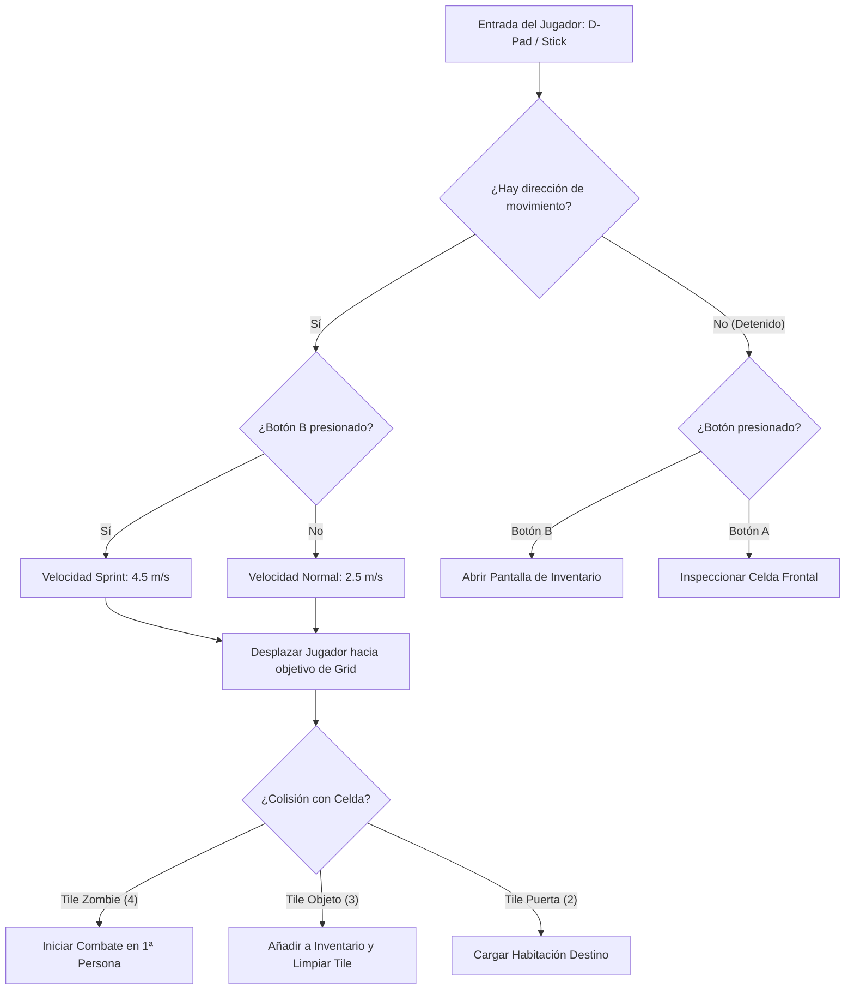

# 03.1 - Sistema de Exploración 2D (Exploration Controller)

## 🗺️ Reconstrucción de la Exploración de GBC a Unity

En el código desensamblado (`decompgaiden/src/exploration.c`):
- El mapa se representa como una matriz de $20 \times 15$ celdas (`s_room_corridor`), correspondiente a los corredores y camarotes del trasatlántico *S.S. Starlight*.
- Tipos de celda:
  - `0`: Suelo transitable.
  - `1`: Pared sólida.
  - `2`: Puerta / Transición de sala.
  - `3`: Objeto recolectable (cajas de munición, hierbas).
  - `4`: Zombie en el mapa (desencadena combate al contacto o inspección).
- Mecánica de sprint y menú:
  - Mantener el botón **B** mientras se camina activa el modo **Sprint** (`is_sprinting = true`).
  - Presionar el botón **B** estando detenido abre el **Inventario** (`STATE_INVENTORY`).
  - Presionar el botón **A** inspecciona la celda adyacente en la dirección en que mira el personaje.

---

## 🏗️ Diagrama de Flujo de Input en Exploración



---

## 💻 Implementación en Unity C# (`ExplorationController.cs`)

```csharp
using UnityEngine;
using Gaiden.Core;
using Gaiden.Managers;

namespace Gaiden.Exploration {
    public class ExplorationController : MonoBehaviour {
        [Header("Velocidades de Movimiento")]
        [SerializeField] private float _walkSpeed = 2.5f;
        [SerializeField] private float _sprintSpeed = 4.5f;

        [Header("Configuración de Cuadrícula")]
        [SerializeField] private LayerMask _obstacleLayers;
        [SerializeField] private LayerMask _interactableLayers;

        private Rigidbody2D _rb;
        private Vector2 _moveInput;
        private Vector2 _facingDirection = Vector2.down;
        private bool _isSprinting;

        private void Awake() {
            _rb = GetComponent<Rigidbody2D>();
        }

        private void Update() {
            // Solo procesar si el juego está en estado de exploración
            if (GaidenGameManager.Instance.CurrentState != GaidenGameState.Exploration) {
                _moveInput = Vector2.zero;
                return;
            }

            HandleInput();
        }

        private void FixedUpdate() {
            MovePlayer();
        }

        private void HandleInput() {
            // Lectura de ejes (D-Pad o Teclas de dirección)
            float h = Input.GetAxisRaw("Horizontal");
            float v = Input.GetAxisRaw("Vertical");

            _moveInput = new Vector2(h, v).normalized;

            if (_moveInput != Vector2.zero) {
                // Actualizar dirección frontal cardinal
                if (Mathf.Abs(h) > Mathf.Abs(v)) {
                    _facingDirection = new Vector2(Mathf.Sign(h), 0);
                } else {
                    _facingDirection = new Vector2(0, Mathf.Sign(v));
                }

                // Botón B mientras se mueve = Sprint
                _isSprinting = Input.GetButton("Fire2") || Input.GetKey(KeyCode.LeftShift);
            } else {
                _isSprinting = false;

                // Botón B sin moverse = Abrir Inventario (Fiel a RE Gaiden GBC)
                if (Input.GetButtonDown("Fire2") || Input.GetKeyDown(KeyCode.I)) {
                    GaidenGameManager.Instance.ChangeState(GaidenGameState.Inventory);
                    return;
                }
            }

            // Botón A = Interactuar con la celda frontal
            if (Input.GetButtonDown("Fire1") || Input.GetKeyDown(KeyCode.E)) {
                TryInteractFront();
            }
        }

        private void MovePlayer() {
            float speed = _isSprinting ? _sprintSpeed : _walkSpeed;
            _rb.linearVelocity = _moveInput * speed;
        }

        private void TryInteractFront() {
            Vector2 checkPos = (Vector2)transform.position + (_facingDirection * 1.0f);
            var hit = Physics2D.OverlapCircle(checkPos, 0.3f, _interactableLayers);

            if (hit != null) {
                if (hit.TryGetComponent<IInteractable>(out var interactable)) {
                    interactable.Interact(this);
                }
            }
        }

        private void OnCollisionEnter2D(Collision2D collision) {
            // Contacto directo con un Zombie en el mapa
            if (collision.gameObject.CompareTag("Enemy")) {
                if (collision.gameObject.TryGetComponent<EnemyOverworldUnit>(out var enemy)) {
                    // Detener jugador y disparar combate
                    _rb.linearVelocity = Vector2.zero;
                    CombatManager.Instance.StartCombat(enemy.EnemyType, enemy);
                }
            }
        }
    }
}
```

---

## 📑 Siguiente Paso Recomendado
Examinar el sistema de combate por retículo oscilante en [[03.2 - Sistema de Combate y Reticula Oscilante]].
