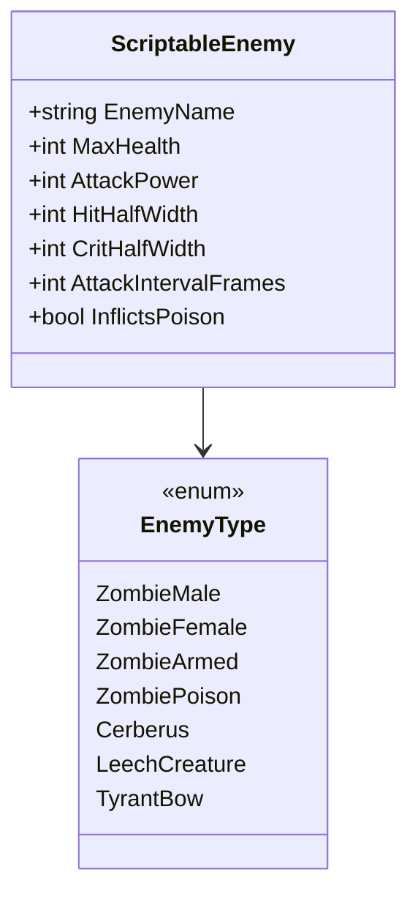

# 03.6 - Sistema de Enemigos e IA de Turnos (Enemy AI & Interval Timers)

Los enemigos en *Resident Evil Gaiden* operan en dos planos completamente distintos:
1. **En el Mapa de Exploración (Overworld)**: Entidades 2D que deambulan por pasillos o montan guardia en puertas y esquinas ciegas.
2. **En la Pantalla de Combate (Combat Arena)**: Actúan como un temporizador implacable. Cada enemigo tiene un contador regresivo (`turn_timer`) que, al llegar a cero, ejecuta un ataque contra el personaje activo.

---

## 🧟 Tipos de Enemigos y Comportamiento en Combate

Basado en la tabla desensamblada de la ROM (`decompgaiden/src/combat.c`):



### Análisis Táctico de Enemigos:
- **Cerberus (Perro zombie)**:
  - Vida baja (35 HP), pero **intervalo muy rápido** (120 frames = 2.0 segundos).
  - Diana crítica minúscula (`CritHalfWidth = 2 px`). Obliga al jugador a disparar rápido antes de ser mordido.
- **Zombie Venenoso**:
  - Al atacar, tiene un 50% de probabilidad de aplicar el estado `IsPoisoned = true`, drenando salud progresivamente.
- **Tyrant B.O.W. (Jefe)**:
  - Enorme tanque biológico con 350 HP y 25 de poder de ataque. Su barra de ataque tarda 4.0 segundos en llenarse (240 frames), pero cada golpe recibido es devastador.

---

## 💻 Implementación de la Unidad en el Mapa (`EnemyOverworldUnit.cs`)

```csharp
using UnityEngine;
using Game.Core;
using Game.Combat;

namespace Game.Units {
    [RequireComponent(typeof(Collider))]
    public class EnemyOverworldUnit : MonoBehaviour {
        [SerializeField] private EnemyType _enemyType;
        [SerializeField] private float _patrolSpeed = 1.0f;
        [SerializeField] private float _detectionRadius = 3.0f;

        public EnemyType EnemyType => _enemyType;
        private ScriptableEnemy _data;
        private Transform _playerTransform;

        public void Initialize(ScriptableEnemy data) {
            _data = data;
            _enemyType = data.EnemyType;
        }

        private void Start() {
            var playerObj = GameObject.FindGameObjectWithTag("Player");
            if (playerObj != null) _playerTransform = playerObj.transform;
        }

        private void Update() {
            if (GameManager.Instance.CurrentState != GameState.Exploration) return;

            // Detección simple del jugador en pasillo
            if (_playerTransform != null) {
                float dist = Vector2.Distance(transform.position, _playerTransform.position);
                if (dist <= _detectionRadius) {
                    // Moverse lentamente hacia el jugador
                    Vector2 dir = (_playerTransform.position - transform.position).normalized;
                    transform.position += (Vector3)(dir * _patrolSpeed * Time.deltaTime);
                }
            }
        }

        private void OnTriggerEnter2D(Collider2D other) {
            if (other.CompareTag("Player")) {
                CombatManager.Instance.StartCombat(_enemyType, this);
            }
        }
    }
}
```

---

## ⏱️ El Ciclo de Turnos de la IA en Combate

Dentro del `CombatManager`, el bucle de actualización decrementa el contador del enemigo en tiempo real:

$$\text{turnTimer} \leftarrow \text{turnTimer} - \Delta t$$

Cuando $\text{turnTimer} \le 0$:
1. Se dispara la animación de ataque del zombie.
2. Se aplica `AttackPower` a `PartyManager.Instance.ActiveHero`.
3. Si el enemigo es venenoso, se activa `PartyManager.Instance.ActiveHero.IsPoisoned = true`.
4. El temporizador se reinicia a `AttackIntervalFrames / 60.0f`.

---

## 📑 Siguiente Paso Recomendado
Examinar los fundamentos teóricos del diseño de sistemas en [[04.1 - Diseno de Sistemas RPG y Survival Horror]].
