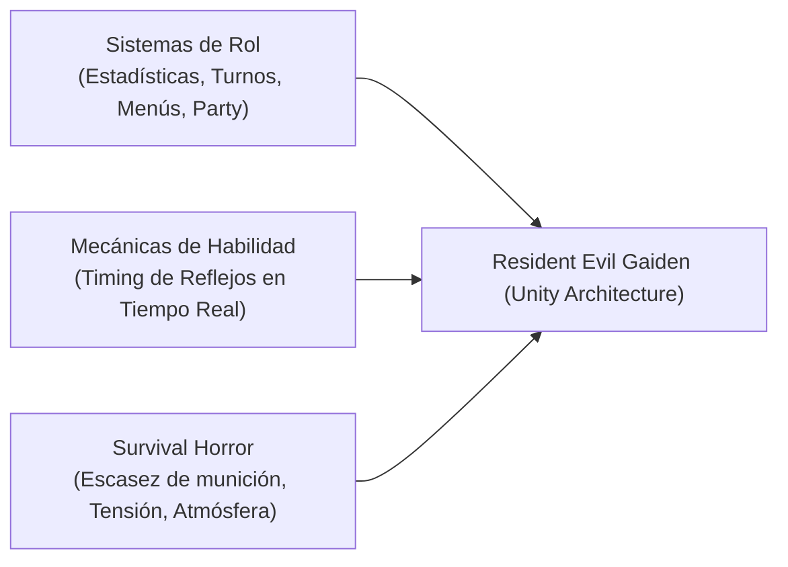

# 04.1 - Diseño de Sistemas RPG y Survival Horror

## 🎲 Fundamentos de Diseño de Sistemas de Juego

En la ingeniería de videojuegos de rol y supervivencia:
> *"Un sistema de juego de rol modela a un personaje en un mundo interactivo donde sus capacidades están regidas por atributos y estadísticas cuantitativas, y el éxito o fracaso de sus acciones depende del balance entre esas estadísticas, la habilidad del jugador y las reglas del sistema."*

### La Hibridación de Gaiden: Survival Horror + RPG
*Resident Evil Gaiden* toma los conceptos clásicos de los RPGs por turnos (perspectiva de combate, gestión de atributos y menús tácticos) y los fusiona con las dinámicas de escasez y tensión del *Survival Horror*:

---

## 📊 Componentes del Diseño en Gaiden

### 1. Estadísticas del Personaje (Stats)
En lugar de un sistema de subida de nivel numérico tradicional que restaría verosimilitud a la experiencia de supervivencia:
- **Puntos de Vida (HP)**: Barry (100 HP), Leon (100 HP), Lucia (120 HP).
- **Resistencia y Estados**: Inmunidad temporal, envenenamiento (`is_poisoned`).
- **Capacidad de Carga**: 8 casillas estrictas para inventario.

### 2. Mecánica de Combate: Azar vs Habilidad (Skill-Based Timing)
En los RPGs tradicionales, el acierto o fallo suele calcularse con una tirada de dados virtual puramente estadística:
$$\text{Acierto} = \text{Random}(0, 100) < \text{Precision}$$

En la arquitectura de *Gaiden*, el azar se sustituye por una **mecánica de habilidad y sincronización temporal**:
- Una aguja que oscila a alta velocidad sobre un medidor horizontal.
- La estadística del enemigo determina **la dificultad de ejecución** (reduciendo el ancho de la zona de impacto `HitHalfWidth` y de crítico `CritHalfWidth`).
- La estadística del arma determina **el multiplicador y el daño base**.

### 3. Estados Alterados (Status Ailments)
El envenenamiento provocado por enemigos biológicos actúa como un drenaje continuo de recursos:
- Si no se contrarresta mediante consumibles específicos (*First Aid Spray* o *Hierba Mixta*), la salud del personaje continúa mermando, forzando decisiones tácticas de uso de suministros.

---

## 📑 Navegación Teórica
- Siguiente fundamento: [[04.2 - Programacion Orientada a Objetos en CSharp]].
- Volver al índice general: [[00 - MOC (Map of Content) - Arquitectura Gaiden Unity]].
