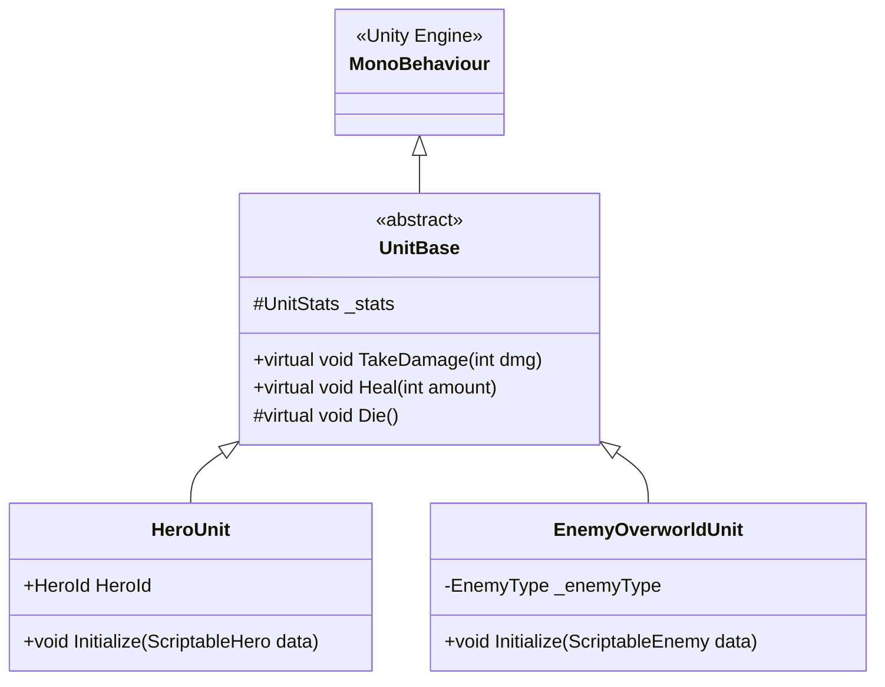
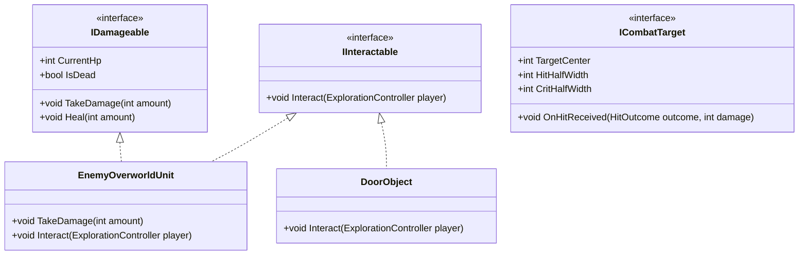

# 04.3 - Herencia e Interfaces en la Arquitectura

Para modelar las entidades del juego y garantizar un acoplamiento bajo entre sistemas, la arquitectura combina una **jerarquía de herencia controlada** con **contratos explícitos mediante interfaces**.

---

## 🧬 Herencia y Polimorfismo

La herencia permite reutilizar lógica compartida entre entidades emparentadas, definiendo una clase base y especializándola mediante subclases:



### Modificadores y Palabras Clave:
1. **`abstract`**: Declara clases o métodos que definen una plantilla sin implementación directa, obligando a las clases derivadas a completarla.
2. **`virtual`**: Habilita la sustitución polimórfica de un método proporcionando una lógica base por defecto.
3. **`override`**: Redefine el comportamiento del método virtual en la clase hija.
4. **`base.Metodo()`**: Invoca explícitamente la rutina original de la clase padre.

---

## 🔌 Interfaces: Desacoplamiento por Contratos

A diferencia de las clases, C# permite que una entidad implemente múltiples **interfaces**. Esto separa lo que un objeto *es* (su herencia) de lo que un objeto *puede hacer* (sus capacidades):



### Definición de Contratos en `Game.Interfaces`:

```csharp
namespace Game.Interfaces {
    public interface IDamageable {
        int CurrentHp { get; }
        bool IsDead { get; }
        void TakeDamage(int amount);
        void Heal(int amount);
    }

    public interface IInteractable {
        void Interact(ExplorationController player);
    }

    public interface ICombatTarget {
        int TargetCenter { get; }
        int HitHalfWidth { get; }
        int CritHalfWidth { get; }
        void OnHitReceived(HitOutcome outcome, int damage);
    }
}
```

---

## 🎯 Ventaja Arquitectural
Cuando el jugador pulsa el botón de acción (**A**) frente a cualquier elemento en el mapa, el sistema de exploración no necesita verificar si el objeto es un cofre, una puerta de camarote o un interruptor eléctrico:
```csharp
if (hitCollider.TryGetComponent<IInteractable>(out var interactable)) {
    interactable.Interact(this);
}
```
Esto respeta el **Principio Abierto/Cerrado (OCP)**: se pueden añadir nuevos objetos interactivos sin modificar una sola línea del controlador de movimiento.

---

## 📑 Navegación Teórica
- Siguiente fundamento: [[04.4 - Genericos y Colecciones en el Motor de Juego]].
- Fundamento anterior: [[04.2 - Programacion Orientada a Objetos en CSharp]].
- Volver al índice general: [[00 - MOC (Map of Content) - Arquitectura Gaiden Unity]].
