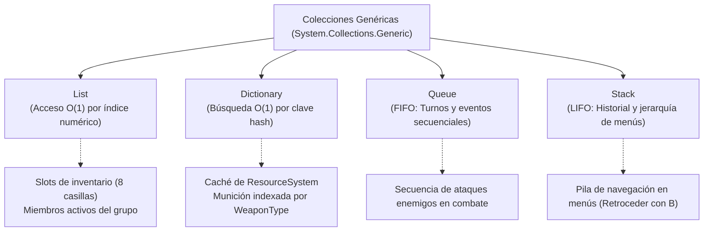

# 04.4 - Genéricos y Colecciones en el Motor de Juego

El rendimiento en tiempo real y la robustez de un videojuego en Unity dependen en gran medida del uso adecuado de **Tipos Genéricos** y de la selección óptima de **Estructuras de Datos y Colecciones**.

---

## 🧰 Genéricos (`Generics`)

Los genéricos permiten parametrizar clases y métodos por tipo (`<T>`), asegurando tipado estricto en tiempo de compilación y eliminando el sobrecoste de operaciones de *boxing/unboxing*.

### Restricciones Genéricas (`where T : Constraint`)
En el patrón `StaticInstance<T>`, las restricciones genéricas garantizan que el tipo sea un componente válido de Unity:
```csharp
public abstract class StaticInstance<T> : MonoBehaviour where T : MonoBehaviour {
    public static T Instance { get; private set; }
    // ...
}
```
La cláusula `where T : MonoBehaviour` permite acceder a la API de Unity (`Destroy`, `DontDestroyOnLoad`, `gameObject`) dentro de la lógica genérica sin requerir conversiones explícitas de tipos.

---

## 📚 Estructuras de Datos Utilizadas en el Proyecto



---

## 🔍 Aplicaciones Específicas en la Arquitectura

### 1. `Dictionary<TKey, TValue>` (Caché de Alto Rendimiento)
En el [[02.4 - Sistema de Recursos y ScriptableObjects|ResourceSystem]], las búsquedas repetidas durante el gameplay se resuelven en tiempo $O(1)$ sin recorrer colecciones lineales:
```csharp
private Dictionary<WeaponType, ScriptableWeapon> _weaponsDict;

public ScriptableWeapon GetWeapon(WeaponType type) => _weaponsDict[type];
```

### 2. `Queue<T>` (Cola de Acciones de Combate)
Cuando múltiples enemigos participan en un encuentro, sus acciones se encolan para evitar superposiciones caóticas en la animación y en el cálculo de daño:
```csharp
private Queue<CombatAction> _actionsQueue = new Queue<CombatAction>();

public void EnqueueAction(CombatAction action) => _actionsQueue.Enqueue(action);
public void ProcessNext() {
    if (_actionsQueue.Count > 0) _actionsQueue.Dequeue().Execute();
}
```

### 3. `Stack<T>` (Historial de Pantallas de UI)
Permite implementar el botón "Atrás" de forma intuitiva durante la navegación de menús complejos (por ejemplo, examinando un arma dentro del maletín):
```csharp
private Stack<UIPanel> _history = new Stack<UIPanel>();

public void PushPanel(UIPanel panel) {
    _history.Push(_currentPanel);
    Open(panel);
}

public void PopBack() {
    if (_history.Count > 0) Open(_history.Pop());
}
```

---

## 📑 Navegación Teórica
- Siguiente fundamento: [[04.5 - Arquitectura Basada en Eventos y Delegados]].
- Fundamento anterior: [[04.3 - Herencia e Interfaces en la Arquitectura]].
- Volver al índice general: [[00 - MOC (Map of Content) - Arquitectura Gaiden Unity]].
