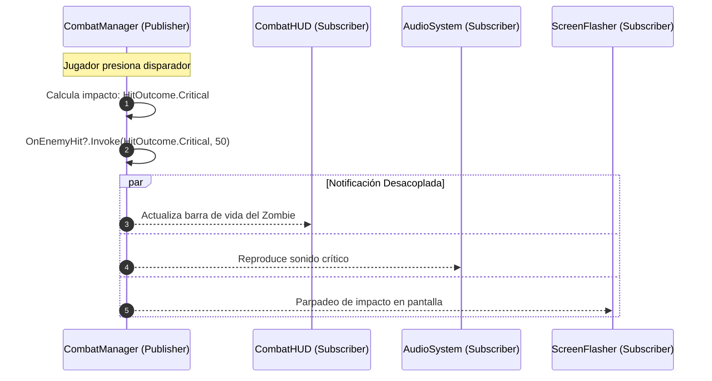

# 04.5 - Arquitectura Basada en Eventos y Delegados

Para evitar el acoplamiento rígido (*Tight Coupling*) entre los subsistemas de simulación (combate, inventario, máquina de estados) y los sistemas de presentación (UI, reproducción de audio, efectos visuales), el proyecto implementa una **Arquitectura Dirigida por Eventos** (*Event-Driven Architecture*) mediante delegados de C#.

---

## 🎯 ¿Qué es un Delegado?

Un delegado es un **tipo de dato que encapsula una referencia segura a un método** con una signatura de parámetros y retorno determinada.

### Delegados Genéricos Nativos de C#:
- **`Action<T1, T2, ...>`**: Representa un método que procesa parámetros y no devuelve ningún valor (`void`).
- **`Func<T1, ..., TResult>`**: Representa un método que procesa parámetros y devuelve un valor de tipo `TResult`.

---

## 📢 Patrón Publicador-Suscriptor (Publisher-Subscriber)

El uso de la palabra clave `event` restringe la invocación del delegado únicamente a la clase que lo declara (**Publisher**), permitiendo a las demás clases (**Subscribers**) únicamente suscribirse (`+=`) o desuscribirse (`-=`).



---

## ⚡ Comparativa de Diseño

### ❌ Enfoque Rígido (Acoplamiento Fuerte):
```csharp
public class CombatManager : MonoBehaviour {
    public CombatHUD hud;
    public AudioSystem audioSystem;

    void ApplyDamage(int dmg) {
        hud.UpdateHealth();
        audioSystem.PlaySound(hitClip);
    }
}
```
*Problemas*:
- `CombatManager` depende obligatoriamente de la presencia de la UI y del Audio.
- No se pueden realizar pruebas unitarias o combates sin cargar interfaces visuales.

---

###  Enfoque Desacoplado (Basado en Eventos):
```csharp
// EN EL GESTOR DE COMBATE (Solo publica lo que ocurrió):
public static event Action<HitOutcome, int> OnEnemyHit;

void ApplyDamage(int dmg) {
    OnEnemyHit?.Invoke(HitOutcome.Critical, dmg);
}

// EN EL HUD DE COMBATE (Escucha y reacciona de forma autónoma):
private void OnEnable() => CombatManager.OnEnemyHit += HandleEnemyHit;
private void OnDisable() => CombatManager.OnEnemyHit -= HandleEnemyHit;

private void HandleEnemyHit(HitOutcome outcome, int damage) {
    UpdateEnemyHealthBar();
}
```

> [!important] Gestión de Ciclo de Vida y Prevención de Memory Leaks
> Toda suscripción a un evento estático (`+=`) realizada en `OnEnable()` o `Start()` debe desuscribirse explícitamente (`-=`) en `OnDisable()` u `OnDestroy()`. De lo contrario, la referencia persistirá en la lista de invocación y el recolector de basura de Unity no podrá liberar la memoria del componente al descargar la escena.

---

## 📑 Navegación Teórica
- Fundamento anterior: [[04.4 - Genericos y Colecciones en el Motor de Juego]].
- Volver al índice general: [[00 - MOC (Map of Content) - Arquitectura Gaiden Unity]].
