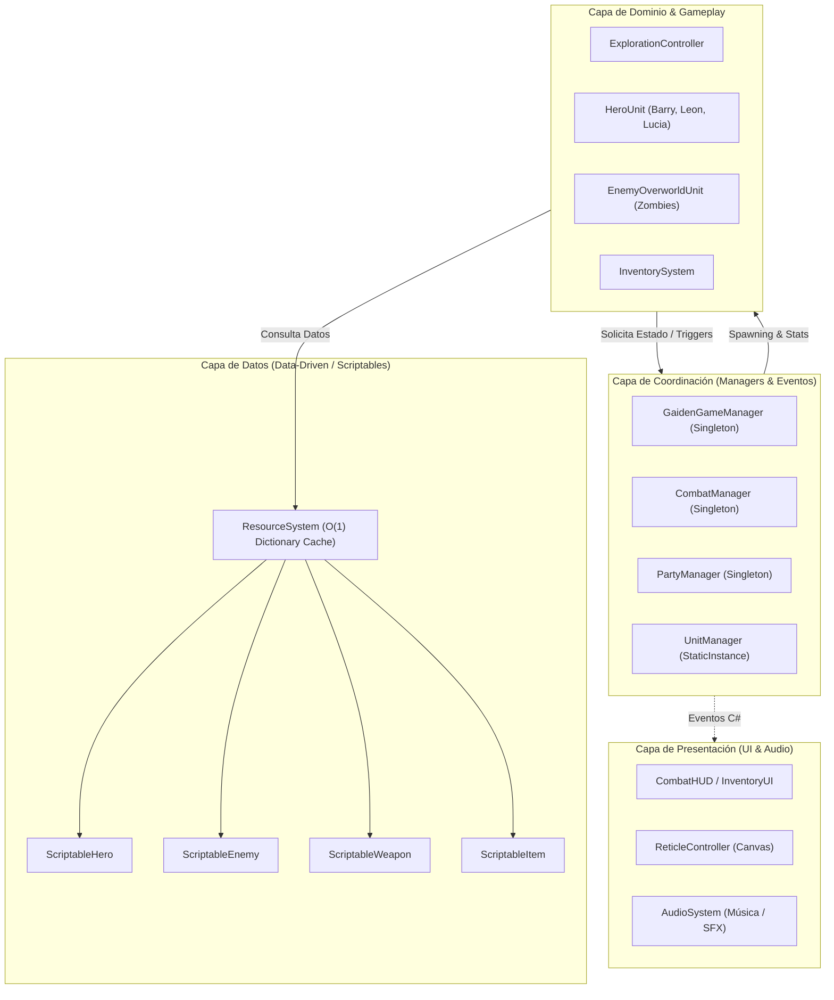
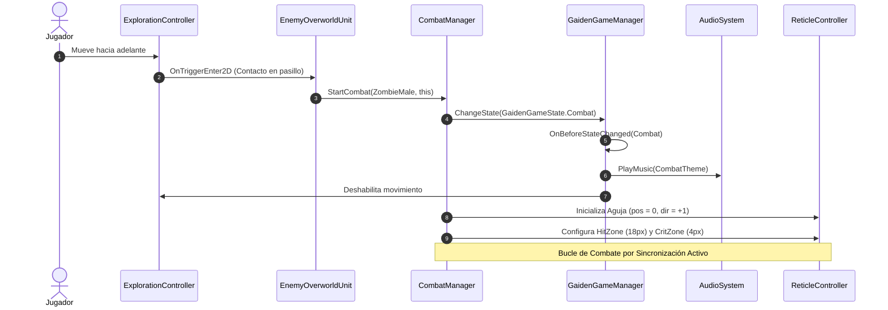
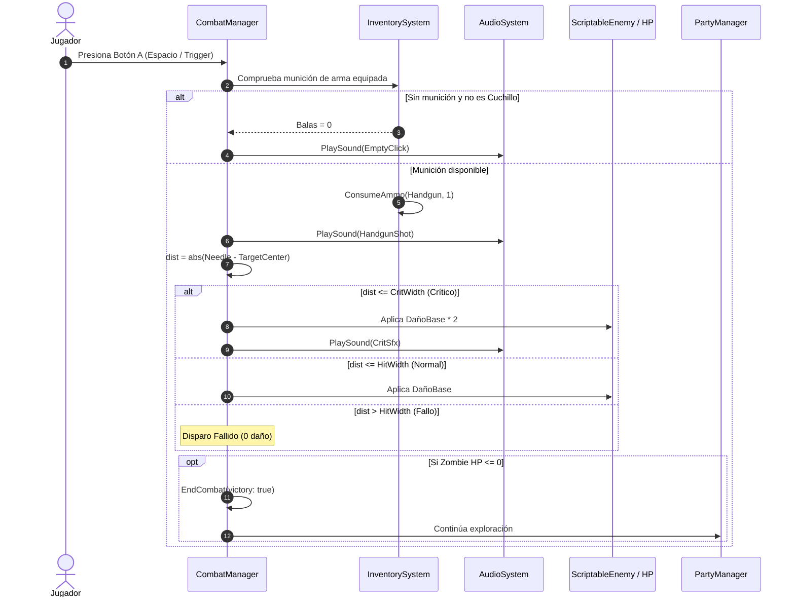
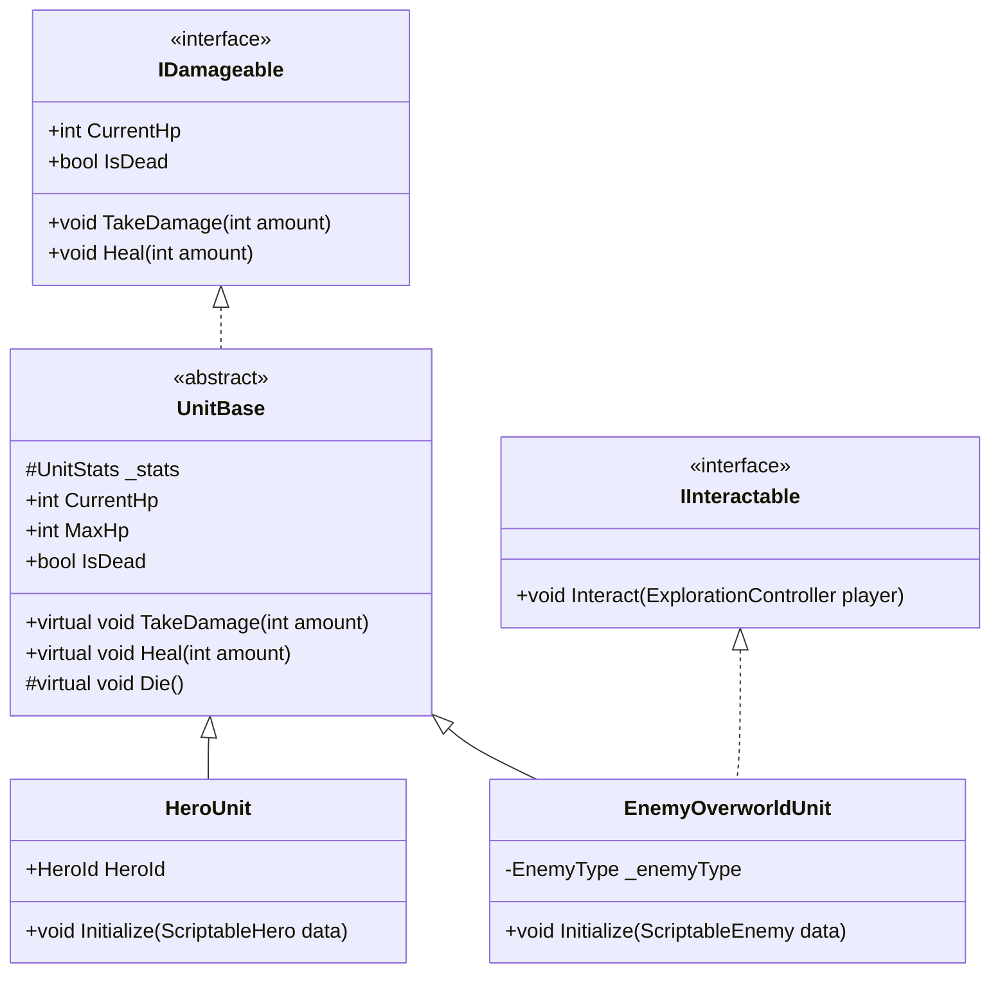

# 06.1 - Diagramas Mermaid de Arquitectura

Esta nota compila los diagramas visuales en **Mermaid** que describen el flujo de datos, la estructura de clases y las secuencias de interacción para el proyecto Resident Evil Gaiden en Unity.

---

## 1. Diagrama de Arquitectura de Capas

---

## 2. Diagrama de Secuencia: Transición de Exploración a Combate

---

## 3. Diagrama de Secuencia: Disparo y Cálculo de Daño

---

## 4. Diagrama de Clases: Jerarquía de Unidades e Interfaces

